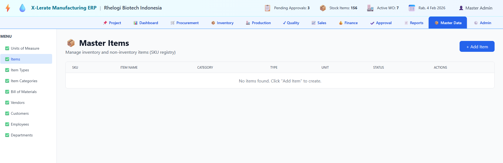

# 📚 Complete Automation Documentation Index

## 🚀 Start Here

### **[QUICK_START.md](QUICK_START.md)** - One Page Reference
- Single command: `npm start`
- What happens automatically
- Test credentials
- Troubleshooting quick-fix

**👉 Read this first!**

---

## 📖 Full Guides

### **[AUTO_SETUP.md](AUTO_SETUP.md)** - Detailed Setup Guide
- Complete setup process
- All available commands
- Database setup details
- Development workflow
- Troubleshooting guide

### **[AUTOMATION.md](AUTOMATION.md)** - System Overview
- What got automated
- Architecture diagram
- Environment setup
- Next steps guide

### **[COMPLETE_AUTOMATION.md](COMPLETE_AUTOMATION.md)** - Comprehensive Guide
- Detailed automation flow
- File watcher behavior
- System architecture
- Performance metrics
- Production notes

---

## ✅ Verification

### **[AUTOMATION_CHECKLIST.md](AUTOMATION_CHECKLIST.md)** - Complete Checklist
- All features verified
- Testing checklist
- Performance targets
- Documentation quality
- Final status

---

## 🎯 Quick Commands

```bash
# Main command (use this!)
npm start

# Alternatives
npm run dev              # Start with details
npm run setup            # Setup only
npm run dev:backend      # Backend only
npm run dev:frontend     # Frontend only

# Utilities
npm run init             # Database init
npm run build            # Production build
npm run lint             # Code quality
npm run format           # Auto-format
npm run clean            # Clean install
npm run reinstall        # Full reinstall
```

---

## 📊 What Was Automated

### Backend
- ✅ File watching (tsx watch)
- ✅ Auto-restart on changes
- ✅ Database auto-init
- ✅ dev:auto script

### Frontend
- ✅ Vite HMR enabled
- ✅ Instant updates
- ✅ File watching
- ✅ dev:auto script

### Database
- ✅ Auto-initialize
- ✅ Auto-create tables
- ✅ Auto-seed users
- ✅ Smart re-use

### Setup
- ✅ Dependency check
- ✅ .env creation
- ✅ Database init
- ✅ Health verify

---

## 📁 Files Added/Modified

### New Scripts
```
scripts/
├── setup.js          Auto setup & validation
├── start.js          Main orchestrator
└── auto-start.js     Alternative starter
```

### Config Changes
```
├── package.json          Root automation commands
├── backend/package.json  Enhanced scripts
├── frontend/package.json Enhanced scripts
└── frontend/vite.config.ts HMR improvements
```

### Documentation
```
├── QUICK_START.md        ← Start here!
├── AUTO_SETUP.md         Detailed guide
├── AUTOMATION.md         Summary
├── COMPLETE_AUTOMATION.md Full reference
├── AUTOMATION_CHECKLIST.md Verification
└── This file (INDEX.md)   Navigation
```

---

## 🌐 Access Points

When running `npm start`:

| Service | URL | Purpose |
|---------|-----|---------|
| Frontend | http://localhost:5173 | Web UI |
| Backend | http://localhost:3000 | REST API |
| Health | http://localhost:3000/api/health | Status |

---

## 🔐 Test Credentials

```
Email:    admin@test.com
Password: admin

Alternative accounts:
- manager@test.com / manager
- supervisor@test.com / supervisor
- staff@test.com / staff
```

---

## 💡 Key Features

1. **One Command**: `npm start` does everything
2. **Auto-Init**: Database creates automatically
3. **Auto-Reload**: Backend restarts on changes
4. **HMR**: Frontend updates instantly
5. **Health Check**: System validates itself
6. **Logging**: Setup logs in `.setup-log`
7. **Graceful**: Ctrl+C shuts down cleanly

---

## 🚀 Quick Start (TL;DR)

1. **Run**: `npm start`
2. **Wait**: For "Everything is Ready!" message
3. **Open**: http://localhost:5173
4. **Login**: admin@test.com / admin
5. **Code**: Changes auto-update instantly

---

## 📖 Documentation Map

```
You are here (INDEX.md)
│
├─→ Need quick reference?
│   └─→ QUICK_START.md
│
├─→ Want detailed setup info?
│   ├─→ AUTO_SETUP.md
│   └─→ AUTOMATION.md
│
├─→ Need comprehensive guide?
│   └─→ COMPLETE_AUTOMATION.md
│
├─→ Want to verify everything?
│   └─→ AUTOMATION_CHECKLIST.md
│
└─→ Ready to start?
    └─→ npm start
```

---

## 🔧 Troubleshooting

### Quick Fixes

**Port in use?**
```bash
npm run clean
npm run reinstall
npm start
```

**Database error?**
```bash
npm run init
npm start
```

**Everything broken?**
```bash
npm run reinstall
npm start
```

**See detailed help**: [AUTO_SETUP.md#Troubleshooting](AUTO_SETUP.md)

---

## 📝 Summary

| Aspect | Status |
|--------|--------|
| Auto setup | ✅ Enabled |
| Auto database | ✅ Enabled |
| Backend auto-reload | ✅ Enabled |
| Frontend HMR | ✅ Enabled |
| File watching | ✅ Enabled |
| Health check | ✅ Enabled |
| Graceful shutdown | ✅ Enabled |

---

## 🎯 Next Steps

1. **Read**: [QUICK_START.md](QUICK_START.md) (5 min)
2. **Run**: `npm start`
3. **Develop**: Open http://localhost:5173
4. **Enjoy**: Auto-reload magic! ✨

---

**Everything is automated. Just run `npm start` and code!** 🚀
