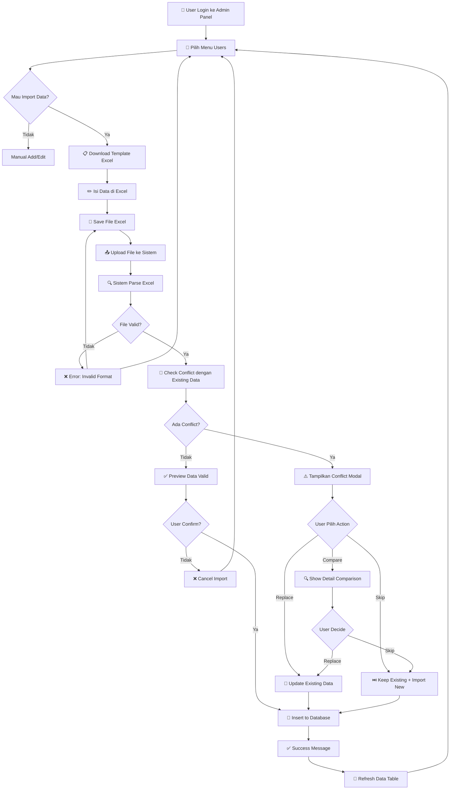
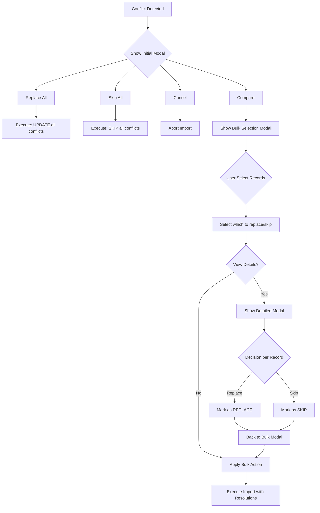

# 📥 Workflow & Rules Import Karyawan

## 📋 Daftar Isi
1. [Overview](#overview)
2. [Workflow Diagram](#workflow-diagram)
3. [Proses Step-by-Step](#proses-step-by-step)
4. [Aturan Validasi](#aturan-validasi)
5. [Field Mapping & Format](#field-mapping--format)
6. [Conflict Handling](#conflict-handling)
7. [Error Handling](#error-handling)
8. [Best Practices](#best-practices)

---

## Overview

Fitur **Import Karyawan** memungkinkan administrator untuk menambahkan data karyawan secara massal menggunakan file Excel (.xlsx, .xls) atau CSV. Sistem dilengkapi dengan:

✅ **Preview Before Import** - Validasi data sebelum disimpan ke database  
✅ **Conflict Detection** - Deteksi otomatis data yang sudah ada  
✅ **Conflict Resolution** - 3 pilihan: Replace, Skip, atau Compare  
✅ **Field Mapping** - Parsing otomatis dengan multiple field name variations  
✅ **Error Reporting** - Pesan error yang jelas dengan nomor baris  
✅ **Rollback Protection** - All-or-nothing import (tidak ada partial import)

---

## Workflow Diagram



---

## Proses Step-by-Step

### **STEP 1: Download Template**

📍 **Lokasi:** Admin Panel → Users Tab → Section "📥 Bulk Import from Excel"

**Aksi:**
1. Klik button **"📋 Download Template"**
2. File `template_users.xlsx` akan terdownload otomatis
3. Buka file dengan Microsoft Excel atau Google Sheets

**Output:**
- File Excel dengan kolom header yang sudah terformat
- 2 baris contoh data untuk referensi format
- Ukuran file: ~17 KB

---

### **STEP 2: Isi Data Karyawan**

**Format Excel:**
```
| NIK    | Name        | Email          | Username | Password  | Phone        | Rank  | Level   | ... |
|--------|-------------|----------------|----------|-----------|--------------|-------|---------|-----|
| EMP001 | John Doe    | john@co.id     | john.doe | pass123   | 08123456789  | Staff | Junior  | ... |
| EMP002 | Jane Smith  | jane@co.id     | jane.s   | pass456   | 08129876543  | SPV   | Senior  | ... |
```

**Kolom yang Tersedia:** (lihat detail di [Field Mapping](#field-mapping--format))
- NIK / Employee ID
- Name
- Email
- Username
- Password
- Phone
- Rank
- Level
- Plant Area
- Department
- Sub Department
- Position
- Education
- Gender
- Status Karyawan
- Role (employee/manager/admin)
- Shift Group

---

### **STEP 3: Upload File**

**Aksi:**
1. Kembali ke Admin Panel → Users Tab
2. Klik button **"Choose Excel File"**
3. Pilih file Excel yang sudah diisi
4. File name akan muncul di UI (contoh: ✓ users_data.xlsx)

**Validasi Client-Side:**
- ✅ File type: `.xlsx`, `.xls`, `.csv` only
- ✅ File size: Maximum 5MB
- ❌ File type lain akan ditolak

---

### **STEP 4: Preview & Validasi**

**Aksi:**
1. Klik button **"👁️ Preview"**
2. Sistem akan:
   - Parse file Excel
   - Normalize field names (case-insensitive, trim whitespace)
   - Validate required fields
   - Check conflicts dengan existing data
   - Generate preview table

**Scenario A: Tidak Ada Conflict**
```
┌────────────────────────────────────────────────────┐
│  ✅ Preview: 10 rows ready to import              │
│                                                    │
│  ┌──────┬──────────┬─────────────┬──────┬───────┐│
│  │ NIK  │ Name     │ Email       │ Dept │ Level ││
│  ├──────┼──────────┼─────────────┼──────┼───────┤│
│  │ 001  │ John Doe │ john@co.id  │ IT   │ Staff ││
│  │ 002  │ Jane S   │ jane@co.id  │ HR   │ SPV   ││
│  │ ...  │ ...      │ ...         │ ...  │ ...   ││
│  └──────┴──────────┴─────────────┴──────┴───────┘│
│                                                    │
│  [✅ Confirm Import]  [❌ Cancel]                 │
└────────────────────────────────────────────────────┘
```

**Scenario B: Ada Conflict**
→ Lanjut ke STEP 5

---

### **STEP 5: Handle Conflicts (Jika Ada)**

Jika sistem menemukan data yang sudah ada di database (berdasarkan NIK, Email, atau Name), conflict modal akan muncul.

#### **Modal 1: Initial Conflict Summary**

```
┌────────────────────────────────────────────────────┐
│  ⚠️ Import Conflict Detected                      │
│                                                    │
│  Found 3 conflicts out of 10 records              │
│                                                    │
│  Conflicts:                                        │
│  • EMP001 - John Doe (john@co.id)                │
│  • EMP002 - Jane Smith (jane@co.id)              │
│  • EMP003 - Bob Wilson (bob@co.id)               │
│                                                    │
│  What do you want to do?                          │
│                                                    │
│  [🔄 Replace All]  - Replace existing with new   │
│  [⏭️ Skip All]     - Keep existing, import new   │
│  [🔍 Compare]      - Review each conflict        │
│  [❌ Cancel]       - Cancel import               │
└────────────────────────────────────────────────────┘
```

**3 Pilihan:**

1. **Replace All** → Semua data yang conflict akan di-update dengan data baru
2. **Skip All** → Semua data yang conflict akan di-skip, hanya import data baru
3. **Compare** → Tampilkan bulk conflict modal untuk pilih satu per satu

#### **Modal 2: Bulk Conflict Selection**

Muncul jika user klik **"Compare"**

```
┌────────────────────────────────────────────────────────────────┐
│  ⚠️ Resolve Data Conflicts (3 conflicts)                      │
│                                                                │
│  [✓] Select All    [ ] Deselect All                           │
│                                                                │
│  ┌──┬──────────┬─────────────┬────────────┬──────────────┐  │
│  │☑ │ NIK      │ Name        │ Old Dept   │ New Dept     │  │
│  ├──┼──────────┼─────────────┼────────────┼──────────────┤  │
│  │☑ │ EMP001   │ John Doe    │ IT         │ Finance      │  │
│  │☐ │ EMP002   │ Jane Smith  │ HR         │ Marketing    │  │
│  │☑ │ EMP003   │ Bob Wilson  │ Sales      │ Operations   │  │
│  └──┴──────────┴─────────────┴────────────┴──────────────┘  │
│                                                                │
│  Action for selected:                                          │
│  ○ Replace with new data                                       │
│  ○ Keep existing data                                          │
│                                                                │
│  [View Details] [Apply to Selected] [Cancel]                  │
└────────────────────────────────────────────────────────────────┘
```

**Fitur:**
- ✅ **Checkbox per row** - Pilih conflict mana yang mau di-handle
- ✅ **Select All / Deselect All** - Bulk selection
- ✅ **Preview Changes** - Lihat perbedaan old vs new
- ✅ **Bulk Action** - Apply action (Replace/Skip) ke semua selected
- ✅ **View Details** - Lihat detail comparison

#### **Modal 3: Detailed Comparison**

Muncul jika user klik **"View Details"** untuk record tertentu

```
┌────────────────────────────────────────────────────────────────┐
│  🔍 Detailed Comparison: EMP001 - John Doe                    │
│                                                                │
│  ┌─────────────────┬────────────────────┬────────────────────┐│
│  │ Field           │ Current (Database) │ New (Import File)  ││
│  ├─────────────────┼────────────────────┼────────────────────┤│
│  │ NIK             │ EMP001            │ EMP001            ││
│  │ Name            │ John Doe          │ John Doe          ││
│  │ Email           │ john@co.id        │ john@co.id        ││
│  │ Phone           │ 08123456789       │ 08199998888       ││
│  │ Department      │ IT Department     │ Finance           ││
│  │ Position        │ Developer         │ Analyst           ││
│  │ Rank            │ Staff             │ Senior Staff      ││
│  │ Level           │ Junior            │ Senior            ││
│  │ Status          │ Active            │ Active            ││
│  │ Education       │ S1                │ S2                ││
│  │ Gender          │ M                 │ M                 ││
│  └─────────────────┴────────────────────┴────────────────────┘│
│                                                                │
│  ⚠️ Changes detected in: Phone, Department, Position, Rank,  │
│     Level, Education                                           │
│                                                                │
│  [🔄 Replace with New]  [⏭️ Keep Current]  [← Back]          │
└────────────────────────────────────────────────────────────────┘
```

---

### **STEP 6: Execute Import**

Setelah user resolve conflicts (atau tidak ada conflict), sistem akan:

1. **Validate Final Data**
   - Re-check required fields
   - Validate data types
   - Check business rules

2. **Database Transaction**
   ```javascript
   BEGIN TRANSACTION
     FOR each record:
       IF conflict resolution = 'replace':
         UPDATE users SET ... WHERE nip = ?
       ELSE IF conflict resolution = 'skip':
         CONTINUE (do nothing)
       ELSE:
         INSERT INTO users (...)
       END IF
     END FOR
   COMMIT
   ```

3. **Return Result**
   ```json
   {
     "success": true,
     "importedCount": 7,
     "updatedCount": 2,
     "skippedCount": 1,
     "message": "Imported 7 users, updated 2, skipped 1"
   }
   ```

---

### **STEP 7: Success & Refresh**

```
┌────────────────────────────────────────────────────┐
│  ✅ Import Successful!                            │
│                                                    │
│  • 7 new employees added                          │
│  • 2 employees updated                            │
│  • 1 employee skipped (kept existing data)        │
│                                                    │
│  Data table will refresh automatically...         │
└────────────────────────────────────────────────────┘
```

**Sistem akan otomatis:**
- ✅ Refresh data table untuk tampilkan data terbaru
- ✅ Reset import form
- ✅ Clear file selection

---

## Aturan Validasi

### **1. Required Fields (Wajib Diisi)**

| Field | Wajib? | Default Value | Validasi |
|-------|--------|---------------|----------|
| **NIK** | Ya* | Auto-generated | Unique identifier |
| **Name** | Ya* | - | Min 2 chars, non-empty |
| **Email** | Opsional | Auto-generated | Format email valid |
| **Username** | Opsional | From email | - |
| **Password** | Opsional | `password123` | Min 6 chars (jika diisi) |
| **Phone** | Opsional | - | Format nomor telepon |
| **Department** | Opsional | - | String |
| **Position** | Opsional | - | String |
| **Rank** | Opsional | - | String |
| **Level** | Opsional | - | String |
| **Status** | Opsional | `Active` | Active / Inactive |
| **Role** | Opsional | `employee` | employee/manager/admin/hr |

*) **Minimal salah satu wajib:** NIK **ATAU** Name

### **2. Validation Rules Detail**

#### **NIK (Nomor Induk Karyawan)**
```yaml
Rule: Unique identifier untuk karyawan
Format: String / Number
Validasi:
  - Harus unique (tidak boleh duplikat dengan existing data)
  - Case-insensitive comparison
  - Whitespace di-trim otomatis
Default:
  - Jika kosong: Auto-generated "EMP{timestamp}{index}"
Contoh:
  - Valid: "EMP001", "12345", "NIK-2024-001"
  - Invalid: NIK yang sudah ada di database
```

#### **Name**
```yaml
Rule: Nama lengkap karyawan
Format: String
Validasi:
  - Minimal 2 karakter
  - Non-empty
  - Boleh ada spasi dan special chars
Default: -
Contoh:
  - Valid: "John Doe", "Budi Santoso", "O'Brien"
  - Invalid: "J", "", " "
```

#### **Email**
```yaml
Rule: Email address untuk login dan komunikasi
Format: email@domain.com
Validasi:
  - Format email standard (user@domain.ext)
  - Harus unique jika diisi
  - Case-insensitive comparison
Default:
  - Jika kosong: "{name}@company.com" (auto-generated)
Contoh:
  - Valid: "john.doe@company.com", "jane@gmail.com"
  - Invalid: "notanemail", "missing@", "@nodomain.com"
```

#### **Username**
```yaml
Rule: Username untuk login
Format: String
Validasi:
  - Harus unique jika diisi
  - No spaces recommended
  - Case-insensitive comparison
Default:
  - Jika kosong: Ambil dari email sebelum @ symbol
  - Contoh: john.doe@company.com → username: "john.doe"
Contoh:
  - Valid: "john.doe", "employee123", "jdoe"
  - Invalid: Username yang sudah ada
```

#### **Password**
```yaml
Rule: Password untuk login
Format: String
Validasi:
  - Minimal 6 karakter (jika diisi)
  - Akan di-hash di production (plaintext di dev)
Default:
  - Jika kosong: "password123"
  - ⚠️ User harus ganti password saat first login!
Security:
  - Password di-hash dengan bcrypt/argon2
  - Tidak boleh sama dengan username
Contoh:
  - Valid: "SecurePass123", "MyP@ssw0rd"
  - Invalid: "12345" (< 6 chars)
```

#### **Phone**
```yaml
Rule: Nomor telepon / HP karyawan
Format: String (phone number)
Validasi:
  - Format bebas (international/lokal)
  - Non-digit characters akan di-strip (opsional)
Default: Empty string
Contoh:
  - Valid: "08123456789", "+62-812-3456-7890", "(021) 1234567"
  - Invalid: -
```

#### **Department**
```yaml
Rule: Departemen/divisi karyawan
Format: String
Validasi:
  - Free text (tidak harus match dengan master departments)
  - Case-insensitive
Default: Empty string
Contoh:
  - Valid: "IT Department", "Finance", "HR & GA"
  - Invalid: -
```

#### **Sub Department**
```yaml
Rule: Sub departemen (opsional, lebih spesifik dari department)
Format: String
Validasi: -
Default: Empty string
Contoh:
  - Department: "IT" → Sub Department: "Infrastructure"
  - Department: "Finance" → Sub Department: "Accounting"
```

#### **Position / Jabatan**
```yaml
Rule: Posisi/jabatan karyawan
Format: String
Validasi: -
Default: Empty string
Contoh:
  - Valid: "Software Engineer", "HR Manager", "Staff Accounting"
  - Invalid: -
```

#### **Rank**
```yaml
Rule: Rank/pangkat karyawan (company-specific)
Format: String
Validasi:
  - Free text (tidak harus match dengan master ranks)
Default: Empty string
Contoh:
  - Valid: "Staff", "Senior Staff", "SPV", "Manager"
  - Invalid: -
```

#### **Level**
```yaml
Rule: Job level karyawan
Format: String
Validasi:
  - Free text (tidak ada enum validation)
  - Recommended: "Junior", "Senior", "Expert", "Lead"
Default: Empty string
Contoh:
  - Valid: "Junior", "Senior", "Mid-Level"
  - Invalid: -
```

#### **Plant Area**
```yaml
Rule: Area lokasi kerja karyawan
Format: String
Validasi:
  - Free text (tidak harus match dengan master plant areas)
Default: Empty string
Contoh:
  - Valid: "Plant 1", "Warehouse A", "Office HQ"
  - Invalid: -
```

#### **Education**
```yaml
Rule: Pendidikan terakhir karyawan
Format: String
Validasi: -
Default: Empty string
Contoh:
  - Valid: "S1", "S2", "SMA", "D3", "PhD"
  - Invalid: -
```

#### **Gender (L/P)**
```yaml
Rule: Jenis kelamin karyawan
Format: Single character or word
Validasi:
  - Accepted: "L", "P", "M", "F", "Male", "Female"
  - Case-insensitive
Default: Empty string
Contoh:
  - Valid: "L", "P", "M", "F"
  - Invalid: -
Normalization:
  - "Male" → "M"
  - "Female" → "F"
  - "L" → "L"
  - "P" → "P"
```

#### **Status Karyawan**
```yaml
Rule: Status kepegawaian
Format: String
Validasi:
  - Recommended: "Active", "Inactive", "Contract", "Permanent"
  - Case-insensitive
Default: "Active"
Contoh:
  - Valid: "Active", "Inactive", "Contract", "Probation"
  - Invalid: -
```

#### **Role**
```yaml
Rule: Role di sistem (untuk permission)
Format: Enum string
Validasi:
  - Allowed values: "employee", "manager", "admin", "hr"
  - Case-insensitive
Default: "employee"
Contoh:
  - Valid: "employee", "manager", "admin", "hr"
  - Invalid: "supervisor", "director" (unless you add them)
Permission Mapping:
  - employee: Basic access (attendance, leave)
  - manager: Approval access
  - hr: HR admin access (payroll, reports)
  - admin: Full system access
```

#### **Shift Group**
```yaml
Rule: ID shift group yang assigned ke karyawan
Format: String (shift group ID or name)
Validasi:
  - Free text (tidak harus match dengan master shift groups)
  - Akan di-assign jika shift group exists
Default: Empty string
Contoh:
  - Valid: "GROUP-A", "Shift-Morning", "12345"
  - Invalid: -
```

#### **isShiftLeader**
```yaml
Rule: Flag apakah karyawan adalah shift leader
Format: Boolean (yes/no, true/false, 1/0)
Validasi:
  - Accepted: "yes", "true", "1", "ya"
  - Case-insensitive
Default: false (0)
Contoh:
  - Valid: "yes", "true", "1", "Ya"
  - Maps to: false untuk nilai lain
```

---

### **3. Business Rules**

#### **Conflict Detection Rules**
```yaml
Conflict terjadi jika SALAH SATU kondisi ini terpenuhi:
  1. NIK sama (case-insensitive, trimmed)
  2. Email sama (case-insensitive, trimmed)
  3. Name sama (exact match, case-insensitive)

Priority Check:
  1. Check NIK first (highest priority)
  2. If NIK not found, check Email
  3. If Email not found, check Name

Normalization:
  - Lowercase conversion
  - Whitespace trim
  - Special character cleanup
```

#### **Import Mode Rules**

**Mode 1: Normal Import (Default)**
```yaml
Behavior:
  - Import hanya data baru (no conflicts)
  - Jika conflict terdeteksi → Show conflict modal
  - User harus resolve conflicts secara manual
Result:
  - importedCount: Jumlah data baru
  - skippedCount: Jumlah conflict yang di-skip
  - updatedCount: 0 (tidak ada update di mode ini tanpa user action)
```

**Mode 2: Replace All Mode**
```yaml
Behavior:
  - DELETE semua existing data di database
  - Import ALL data dari file sebagai data baru
  - ⚠️ DESTRUCTIVE OPERATION!
Warning:
  - Harus ada konfirmasi dari user
  - Data lama akan hilang PERMANEN
  - Recommended untuk initial setup only
Result:
  - importedCount: Semua rows dari file
  - deletedCount: Semua rows di database sebelumnya
```

**Mode 3: Conflict Resolution Mode**
```yaml
Behavior:
  - User pilih action untuk tiap conflict:
    a. Replace: Update existing dengan data baru
    b. Skip: Keep existing data
  - Data tanpa conflict langsung di-import
Result:
  - importedCount: Data baru
  - updatedCount: Data yang di-replace
  - skippedCount: Data yang di-skip
```

#### **Transaction Rules**
```yaml
All-or-Nothing:
  - Import adalah ATOMIC operation
  - Jika 1 row gagal → Semua rows rollback
  - Database consistency terjaga

Error Handling:
  - Stop-on-first-error strategy
  - Error akan include row number dan field details
  - No partial import (data tidak setengah masuk)
```

---

## Field Mapping & Format

### **Excel Column Name Variations**

Sistem akan automatically recognize berbagai variasi nama kolom. Case-insensitive dan whitespace akan di-ignore.

| Standard Field | Alternative Names (Accepted) |
|----------------|------------------------------|
| **nip** | NIK, EmployeeID, Employee ID, NIP, Nomor Induk |
| **name** | Name, Nama, Nama Karyawan, Full Name, Employee Name |
| **email** | Email, E-mail, Email Address |
| **username** | Username, User Name, Login |
| **password** | Password, Pass, Kata Sandi |
| **phone** | Phone, Phone Number, Telepon, No HP, No Telp |
| **rank** | Rank, Pangkat, Rank Terbaru |
| **level** | Level, Job Level, Jenjang |
| **plantArea** | Plant Area, Plant, Lokasi, Area Pabrik |
| **department** | Department, Dept, Departemen, Divisi |
| **subDepartment** | Sub Department, Sub Dept, Seksi, Sub Divisi |
| **position** | Position, Jabatan, Job Title |
| **education** | Education, Pendidikan, Pend, Edukasi |
| **gender** | Gender, L/P, Jenis Kelamin, Sex |
| **status** | Status, Status Karyawan, Employment Status |
| **shiftGroup** | Shift Group, Shift, Group Shift |
| **role** | Role, User Role, Hak Akses |

**Contoh Mapping:**
```javascript
// Excel Column: "Nama Karyawan"
// Normalized to: "namakaryawan"
// Mapped to: "name" field

// Excel Column: "No. HP"
// Normalized to: "nohp"
// Mapped to: "phone" field

// Excel Column: "L / P"
// Normalized to: "lp"
// Mapped to: "gender" field
```

---

### **Template Excel Format**

#### **Headers (Row 1)**
```
NIK | Name | Email | Phone | Department | Position | Rank | Level | Gender | Status
```

#### **Sample Data (Rows 2-3)**
```
EMP001 | John Doe | john@co.id | 08123456789 | IT | Developer | Staff | Junior | L | Active
EMP002 | Jane Smith | jane@co.id | 08199887766 | HR | Manager | SPV | Senior | P | Active
```

#### **Your Data (Row 4+)**
```
(isi data karyawan Anda di sini...)
```

---

### **Download Template API**

```http
GET /api/admin/import/template/users
Authorization: Bearer {token}
```

**Response:**
- File: `template_users.xlsx`
- Size: ~17 KB
- Format: Excel 2007+ (.xlsx)

**Template Structure:**
```javascript
{
  sheetName: "Users",
  columns: [
    { header: "NIK", key: "nip", width: 15 },
    { header: "Name", key: "name", width: 25 },
    { header: "Email", key: "email", width: 30 },
    { header: "Username", key: "username", width: 20 },
    { header: "Password", key: "password", width: 15 },
    { header: "Phone", key: "phone", width: 20 },
    { header: "Department", key: "department", width: 20 },
    { header: "Position", key: "position", width: 20 },
    { header: "Rank", key: "rank", width: 15 },
    { header: "Level", key: "level", width: 15 },
    { header: "Plant Area", key: "plantArea", width: 20 },
    { header: "Education", key: "education", width: 15 },
    { header: "Gender", key: "gender", width: 10 },
    { header: "Status", key: "status", width: 15 },
    { header: "Role", key: "role", width: 15 }
  ],
  sampleData: [
    { nip: "EMP001", name: "John Doe", email: "john@co.id", ... },
    { nip: "EMP002", name: "Jane Smith", email: "jane@co.id", ... }
  ]
}
```

---

## Conflict Handling

### **Conflict Detection Logic**

```javascript
function detectConflicts(newData, existingData) {
  const conflicts = [];
  
  for (let newRecord of newData) {
    for (let existingRecord of existingData) {
      // Normalize untuk comparison
      const newNip = String(newRecord.nip || '').trim().toLowerCase();
      const existingNip = String(existingRecord.nip || '').trim().toLowerCase();
      
      const newEmail = String(newRecord.email || '').trim().toLowerCase();
      const existingEmail = String(existingRecord.email || '').trim().toLowerCase();
      
      const newName = String(newRecord.name || '').trim().toLowerCase();
      const existingName = String(existingRecord.name || '').trim().toLowerCase();
      
      // Check conflict (priority: NIK > Email > Name)
      if (newNip && existingNip && newNip === existingNip) {
        conflicts.push({
          type: 'nip',
          identifier: newNip,
          newRecord,
          existingRecord
        });
        break;
      }
      
      if (newEmail && existingEmail && newEmail === existingEmail) {
        conflicts.push({
          type: 'email',
          identifier: newEmail,
          newRecord,
          existingRecord
        });
        break;
      }
      
      if (newName && existingName && newName === existingName) {
        conflicts.push({
          type: 'name',
          identifier: newName,
          newRecord,
          existingRecord
        });
        break;
      }
    }
  }
  
  return conflicts;
}
```

---

### **Resolution Options**

#### **Option 1: Replace with New Data**
```yaml
Action: UPDATE existing record dengan data dari import file
Effect:
  - Existing data akan OVERWRITE
  - Semua fields di-update (kecuali yang kosong di file)
  - ID tetap sama (tidak create new record)
Use Case:
  - Update data karyawan yang sudah ada
  - Correct mistakes di data lama
  - Migration dari system lain
SQL:
  UPDATE users 
  SET name = ?, email = ?, phone = ?, ... 
  WHERE id = ?
```

#### **Option 2: Keep Existing Data (Skip)**
```yaml
Action: SKIP import untuk record ini
Effect:
  - Existing data TIDAK berubah
  - Import file record DIABAIKAN
  - No database operation
Use Case:
  - Protect existing data dari overwrite
  - Import hanya data baru saja
  - Prevent duplicate entries
SQL:
  (no query - skip this record)
```

#### **Option 3: Compare & Decide**
```yaml
Action: Show detailed comparison modal
Effect:
  - User lihat side-by-side comparison
  - User decide per field atau per record
  - More granular control
Use Case:
  - Unsure mana data yang benar
  - Perlu review changes carefully
  - Sensitive data updates
UI:
  - Detail modal dengan field-by-field comparison
  - Highlight differences
  - User choose Replace or Skip after review
```

---

### **Bulk Conflict Actions**

```yaml
Select All + Replace:
  - Semua conflicts akan di-replace dengan data baru
  - Efficient untuk mass update
  
Select All + Skip:
  - Semua conflicts akan di-skip
  - Hanya import data yang benar-benar baru
  
Selective:
  - Checkbox per record
  - Mix of replace & skip
  - Example: Replace 5 records, skip 3 records
```

---

### **Conflict Resolution Flow**



---

## Error Handling

### **Error Types**

#### **1. File Upload Errors**

```yaml
Error: "No file uploaded"
Cause: User klik Preview/Import tanpa pilih file
Solution: Klik "Choose File" dulu, pilih file Excel
HTTP: 400 Bad Request
```

```yaml
Error: "Invalid file type"
Cause: File bukan .xlsx, .xls, atau .csv
Solution: Upload file Excel yang valid
HTTP: 400 Bad Request
```

```yaml
Error: "File too large (max 5MB)"
Cause: File size > 5MB
Solution: 
  - Reduce rows (split jadi multiple files)
  - Compress/optimize Excel file
HTTP: 413 Payload Too Large
```

---

#### **2. Parse Errors**

```yaml
Error: "Failed to parse Excel"
Cause: 
  - File corrupted
  - Invalid Excel format
  - Password-protected file
Solution:
  - Re-download template
  - Copy data ke template baru
  - Save as .xlsx (not .xls or .xlsm)
HTTP: 500 Internal Server Error
```

```yaml
Error: "No data found in file"
Cause: Excel file kosong atau hanya ada headers
Solution: Isi minimal 1 row data
HTTP: 400 Bad Request
```

```yaml
Error: "Unknown column format"
Cause: Headers di Excel tidak match dengan expected columns
Solution:
  - Use provided template
  - Jangan rename column headers
  - Check typo di column names
HTTP: 400 Bad Request
```

---

#### **3. Validation Errors**

```yaml
Error: "Missing required fields: name"
Cause: Row ada yang kosong untuk field "name"
Solution: Isi field name atau NIK (minimal salah satu)
Row: Row number will be specified
HTTP: 400 Bad Request
```

```yaml
Error: "Invalid email format"
Cause: Email tidak match pattern user@domain.com
Solution: Correct email format
Example: 
  ❌ "notanemail" 
  ✅ "user@company.com"
Row: Row number specified
HTTP: 400 Bad Request
```

```yaml
Error: "NIK already exists: {nip}"
Cause: NIK sudah ada di database
Solution:
  - Change NIK ke unique value
  - Atau handle via conflict resolution (replace/skip)
Row: Row number specified
HTTP: 409 Conflict
```

```yaml
Error: "Email already exists: {email}"
Cause: Email sudah registered
Solution: 
  - Use different email
  - Atau handle via conflict resolution
Row: Row number specified
HTTP: 409 Conflict
```

```yaml
Error: "Invalid role: {role}. Must be one of: employee, manager, admin, hr"
Cause: Role value tidak termasuk allowed values
Solution: Use: employee, manager, admin, atau hr
Row: Row number specified
HTTP: 400 Bad Request
```

---

#### **4. Database Errors**

```yaml
Error: "Database connection failed"
Cause: Backend tidak bisa connect ke MySQL
Solution:
  - Check database server running
  - Check Docker containers: docker-compose ps
  - Restart backend: docker-compose restart backend
HTTP: 500 Internal Server Error
```

```yaml
Error: "Transaction rollback: {reason}"
Cause: Import failed mid-process, all changes reverted
Solution:
  - Check error reason
  - Fix data in Excel
  - Retry import
HTTP: 500 Internal Server Error
```

```yaml
Error: "Duplicate entry for key 'email'"
Cause: Email constraint violation di database
Solution:
  - Database level constraint
  - Fix duplicate emails in Excel
  - Should be caught by validation (bug if this appears)
HTTP: 500 Internal Server Error
```

---

### **Error Response Format**

```json
{
  "success": false,
  "message": "Validation failed",
  "error": {
    "rowNumber": 5,
    "field": "email",
    "value": "invalid-email",
    "errors": [
      "Invalid email format"
    ]
  }
}
```

**Fields:**
- `success`: Always `false` untuk errors
- `message`: Human-readable error summary
- `error.rowNumber`: Excel row number (1-based, excluding header)
- `error.field`: Field name yang error
- `error.value`: Value yang invalid
- `error.errors`: Array of error messages

---

### **Error Display in UI**

```html
<div class="error-alert" id="users-error">
  <h4>⚠️ Import Error</h4>
  <p id="users-error-message">Validation failed at row 5</p>
  <div class="error-details">
    <strong>Field:</strong> email<br>
    <strong>Value:</strong> "invalid-email"<br>
    <strong>Error:</strong> Invalid email format
  </div>
  <button onclick="closeError('users')">Close</button>
</div>
```

**Styling:**
- Background: Red (#ffebee)
- Border: Dark red (#c62828)
- Icon: ⚠️ Warning
- Close button: X di pojok kanan atas

---

## Best Practices

### **📋 Untuk User/Admin**

#### **1. Preparation**
```yaml
✅ Download template dari sistem (jangan buat sendiri)
✅ Isi data di Excel dengan teliti
✅ Check required fields (NIK dan Name minimal salah satu)
✅ Validate email format sebelum upload
✅ Check for duplicate NIK/Email dalam file Excel
✅ Save as .xlsx format (not .xls or .csv if possible)
✅ Test dengan data kecil dulu (5-10 rows)
```

#### **2. Data Entry**
```yaml
✅ Use consistent format untuk phone (08xxx atau +62xxx)
✅ Use standard department names (jangan typo)
✅ Use standard position names
✅ Gender: Use "L" atau "P" (or "M" or "F")
✅ Status: Use "Active" atau "Inactive"
✅ Role: Use "employee" untuk most staff
✅ NIK: Use format yang konsisten (e.g., EMP001, EMP002)
```

#### **3. Import Process**
```yaml
✅ Preview dulu sebelum confirm import
✅ Review conflicts carefully (jangan asal replace)
✅ Backup existing data sebelum replace all
✅ Import di low-traffic hours (malam/weekend) untuk mass import
✅ Test di development environment dulu jika possible
```

#### **4. Error Handling**
```yaml
✅ Read error messages carefully
✅ Fix errors di Excel file, jangan coba workaround
✅ Jika conflict: Decide case-by-case (review detail modal)
✅ Jika unsure: Skip dan update manual later
✅ Keep log of imported files (backup)
```

---

### **🛠️ Untuk Developer**

#### **1. Code Structure**
```javascript
// ✅ GOOD: Clear separation of concerns
function parseWorkbook(buffer) { /* parse */ }
function validateData(data) { /* validate */ }
function detectConflicts(newData, existingData) { /* detect */ }
function importData(data, resolutions) { /* import */ }

// ❌ BAD: Everything in one function
function doImport(file) {
  // parse + validate + conflict + import all in one
}
```

#### **2. Validation**
```javascript
// ✅ GOOD: Validate early and clearly
if (!data.name && !data.nip) {
  return {
    valid: false,
    error: "Missing required fields: name or nip"
  };
}

// ✅ GOOD: Normalize before comparison
const normalizedNip = String(nip || '').trim().toLowerCase();

// ❌ BAD: Silent failures
if (nip) { /* assume valid */ }
```

#### **3. Error Messages**
```javascript
// ✅ GOOD: Specific and actionable
throw new Error(`Invalid email format at row ${rowNum}: "${email}". ` +
                `Expected format: user@domain.com`);

// ❌ BAD: Vague
throw new Error('Invalid data');
```

#### **4. Transaction Handling**
```javascript
// ✅ GOOD: All-or-nothing with rollback
const connection = await db.getConnection();
await connection.beginTransaction();
try {
  for (let record of data) {
    await connection.query('INSERT ...', [record]);
  }
  await connection.commit();
} catch (error) {
  await connection.rollback();
  throw error;
} finally {
  connection.release();
}

// ❌ BAD: No transaction (partial imports)
for (let record of data) {
  await db.query('INSERT ...', [record]); // Each is committed immediately
}
```

#### **5. Performance**
```javascript
// ✅ GOOD: Batch operations
const values = data.map(d => [d.nip, d.name, d.email]);
await db.query('INSERT INTO users (nip, name, email) VALUES ?', [values]);

// ❌ BAD: Individual inserts
for (let record of data) {
  await db.query('INSERT INTO users ...', [record]); // N queries
}

// ✅ GOOD: Stream large files
const stream = fs.createReadStream(filePath);
const workbook = XLSX.read(stream, { type: 'stream' });

// ❌ BAD: Load entire file to memory
const buffer = fs.readFileSync(filePath); // 100MB+ files?
```

#### **6. Security**
```javascript
// ✅ GOOD: Parameterized queries
await db.query('INSERT INTO users (name) VALUES (?)', [userName]);

// ❌ BAD: String concatenation (SQL injection!)
await db.query(`INSERT INTO users (name) VALUES ('${userName}')`);

// ✅ GOOD: File type validation
const allowedTypes = ['.xlsx', '.xls', '.csv'];
const ext = path.extname(file.originalname).toLowerCase();
if (!allowedTypes.includes(ext)) {
  throw new Error('Invalid file type');
}

// ✅ GOOD: File size limit
app.use('/import', upload({
  limits: { fileSize: 5 * 1024 * 1024 } // 5MB
}));
```

#### **7. Logging**
```javascript
// ✅ GOOD: Structured logging
console.log('[IMPORT] Processing file:', {
  filename: file.originalname,
  size: file.size,
  rowCount: data.length,
  timestamp: new Date().toISOString()
});

// ✅ GOOD: Log conflicts
console.log('[IMPORT] Conflicts detected:', {
  count: conflicts.length,
  types: conflicts.map(c => c.type),
  identifiers: conflicts.map(c => c.identifier)
});

// ❌ BAD: No logging or vague logging
console.log('Importing...'); // Not enough context
```

---

### **⚡ Performance Tips**

#### **For Large Imports (1000+ rows)**

```yaml
1. Batch Insert:
   - Don't insert row-by-row
   - Use batch INSERT (1000 rows per batch)
   - Example: INSERT INTO users (...) VALUES (...), (...), (...)

2. Disable Indexes (Temporary):
   - ALTER TABLE users DISABLE KEYS (before import)
   - ALTER TABLE users ENABLE KEYS (after import)
   - Significantly faster for bulk ops

3. Transaction Size:
   - Don't commit after each row
   - Commit after batch (e.g., every 1000 rows)
   - Balance: Large = faster but more memory

4. Parallel Processing:
   - Split large file to multiple chunks
   - Process chunks in parallel workers
   - Use queue system (Bull, RabbitMQ)

5. Progress Indicator:
   - Show progress bar untuk user
   - Prevent timeout di frontend
   - Use WebSocket for real-time updates

6. Optimize Validation:
   - Validate in memory first (before DB queries)
   - Batch duplicate check queries
   - Use IN clause: SELECT nip FROM users WHERE nip IN (...)

7. Resource Management:
   - Stream processing untuk files > 10MB
   - Limit concurrent imports (1-2 per system)
   - Clean up temp files after import
```

---

### **🔒 Security Checklist**

```yaml
✅ Authentication:
   - Require valid JWT token
   - Check user role (admin/hr only)
   - Validate token not expired

✅ Authorization:
   - Check permission level
   - Log who imported what
   - Audit trail for changes

✅ Input Validation:
   - Sanitize all fields
   - Prevent XSS (escape HTML)
   - Prevent SQL injection (parameterized queries)
   - File type whitelist
   - File size limit

✅ Data Protection:
   - Hash passwords before storing
   - Encrypt sensitive fields (optional)
   - Don't log passwords
   - HTTPS only untuk production

✅ Rate Limiting:
   - Max 5 imports per user per hour
   - Max file size 5MB
   - Prevent DOS attacks

✅ Error Handling:
   - Don't expose internal errors to user
   - Log detailed errors server-side
   - Generic error messages client-side
   - No stack traces in production
```

---

## Summary

### **Quick Reference**

| Aspect | Detail |
|--------|--------|
| **File Format** | Excel (.xlsx, .xls) or CSV |
| **Max File Size** | 5MB |
| **Required Fields** | NIK or Name (minimal salah satu) |
| **Conflict Detection** | NIK, Email, or Name match |
| **Conflict Options** | Replace, Skip, Compare |
| **Import Mode** | Normal, Replace All, Resolution |
| **Validation** | Stop-on-first-error |
| **Transaction** | All-or-nothing (atomic) |
| **Performance** | ~1000 rows in <10 seconds |
| **Security** | JWT auth, role-based access |

---

### **API Endpoints Summary**

```yaml
Download Template:
  GET /api/admin/import/template/users
  Auth: Required (Bearer token)
  Response: Excel file

Preview Import:
  POST /api/admin/import/preview/users
  Auth: Required
  Body: multipart/form-data (file)
  Response: { success, validation: { validRows, data, conflicts } }

Execute Import:
  POST /api/admin/import/users
  Auth: Required
  Body: multipart/form-data (file, replace?, conflictResolutions?)
  Response: { success, importedCount, updatedCount, skippedCount, message }
```

---

### **Common Workflows**

#### **Scenario 1: Import New Employees (No Conflicts)**
1. Download template
2. Fill data
3. Upload file
4. Preview → No conflicts detected
5. Confirm import
6. ✅ Success → Data table refreshed

#### **Scenario 2: Import with Conflicts (Update Existing)**
1. Download template
2. Fill data (some NIKs already exist)
3. Upload file
4. Preview → Conflicts detected (e.g., 3 conflicts)
5. Initial modal → Click "Replace All"
6. Confirm: "Replace 3 existing records with new data?"
7. ✅ Success → 3 updated, 7 new imported

#### **Scenario 3: Import with Selective Conflict Resolution**
1. Download template
2. Fill data
3. Upload file
4. Preview → 5 conflicts detected
5. Initial modal → Click "Compare"
6. Bulk modal → Select 3 records, choose "Replace"
7. Bulk modal → Select 2 records, choose "Skip"
8. Apply
9. ✅ Success → 3 updated, 2 skipped, 10 new imported

---

**Last Updated:** February 8, 2026  
**Version:** 2.0  
**Status:** ✅ Production Ready

---

## 📞 Support & Contact

Untuk pertanyaan atau issues:
- **Technical Issues:** Check logs di `docker-compose logs -f backend`
- **Data Issues:** Review Excel file format dan validation rules
- **Conflict Issues:** Use detailed comparison modal untuk investigate

**Happy Importing! 🚀**
