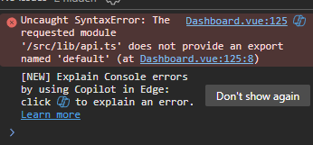

Quick Chat Summary (paste to new chat)
- Goal: Build Manufacturing ERP for small biochemical company; complete modules and fix issues fast.
- Current focus: Procurement module SQLite -> MySQL conversion and endpoint stabilization.
- Stack: Node.js/Express/TypeScript + MySQL; Vue 3 + Vite + Tailwind.
- Key modules: Products, BOM, Procurement, Inventory, Work Orders, Auth.
- Recent changes: Converted procurement routes to dbGet/dbAll/dbRun; fixed FK nullable issues.
- Current issue: Some procurement endpoints return 500; need log-driven SQL fixes.
- Files of interest: backend/src/routes/procurement.routes.ts; backend/database/schema_mysql.sql.
- Next action: Check backend logs for failing queries; validate PO list/vendor prices/history queries.

---

📄 ERP Manufacturing & Distribution Specification
Version 1.0 — Biochemical Small Enterprise ERP
Author: Mismerak (Gallan)
Last Updated: {{ auto today }}
#️⃣ 1. Company Overview
Company Size: Small (20–80 employees)
Industry: Biochemical Manufacturing, Distribution, Sales
Core Business Processes:

Production (Batch-based biochemical products)

Warehouse & Distribution

Procurement

Sales (B2B / Distributor Model)

Key Compliance Needs:

Batch Lot Traceability

QC/QA Documentation

Production Logs

Material Cost & Yield Control

#️⃣ 2. ERP System Objectives
ERP ini dibangun untuk:

Menyatukan seluruh proses bisnis dalam satu platform

Mengurangi input manual / spreadsheet

Memenuhi traceability batch dari RM → WIP → FG

Mempercepat alur approval dan dokumentasi

Menyediakan dashboard KPI bagi plant management

Mempersiapkan scale-up process ke medium company

#️⃣ 3. Technology Stack (Preferred)
Layer	Technology
Backend	Laravel 11 / Node.js (NestJS)
Frontend	React.js / Livewire 3
Database	MySQL / MariaDB
Authentication	JWT + RBAC
Infrastructure	Docker-ready engine
Integration	REST API + Webhooks
CI/CD	GitHub Actions (optional)

Copilot boleh memberikan alternatif dengan argumentasi.

#️⃣ 4. Core ERP Modules
## 4.1 Product Management
Features
Product Master

Product Categories

UoM (Unit of Measure)

Packaging options

Material Safety Data (optional)

Bill of Materials (BOM)
Multi-level structure

Raw materials + active biochemical content

Packaging BOM

Versioning support

Standard & actual material cost

## 4.2 Inventory & Warehouse
Features
Multi-Warehouse support

Warehouse Location (Rack → Row → Bin optional)

Stock Card Movement

FIFO / FEFO

Real-time stock

Stock Transactions
Material Receipt (GRN)

Material Issue to Production

Transfer Warehouse

Stock Adjustment

Stock Opname

Traceability
Batch/Lot number auto generation

RM → WIP → FG mapping

## 4.3 Procurement
Flow
PR → PO → Approval → GRN → Invoice (optional AP)

Features
Vendor Master

Purchase Request (PR)

Purchase Order (PO)

PO Approval Routing

GRN linked to PO

Price History

Lead Time Monitoring

## 4.4 Production / Manufacturing
A. Production Planning (MRP-lite)
Check RM availability

Work Order creation

Routing / Work Center
-Machine requirement per process

Operator assignment

B. Shopfloor Execution
Issue RM

Batch number creation

Process logs:

Mixing

Reaction

Heating/Cooling

Dilution

QC Testing

Packaging

C. Data Recording
Actual material usage

Output yield (KG / Litre)

Loss/waste %

QC results

Batch Release Approval

## 4.5 Sales & Distribution
Features
Customer Master

Sales Order

Price List

Delivery Order & Shipment

Stock deduction from FG warehouse

Sales Invoice

Basic AR monitoring

## 4.6 Finance (Simplified)
Features
COGS per batch (based on actual usage)

PO → AP

Shipment → AR

Profitability per product

Monthly Cost Summary

Note: No full accounting ledger, only operational finance.

## 4.7 Human Resources (Lite)
Features
Employee database

Departments & Role

Shift schedule

Attendance log (manual or integrated)

Overtime form + approval

## 4.8 System Administration
Features
Users & Roles (RBAC)

Permission Matrix

Approval Rules Engine

Audit Log per action

Notification Center

Dashboard KPI

KPI Ideas
Production Plan vs Actual

RM Stock Aging

Material Consumption Variance

Sales Performance

Outstanding Approvals

#️⃣ 5. Data Model Requirements
Copilot harus menghasilkan ERD dengan tabel berikut:

Master
products

product_categories

uom

BOM
bom_headers

bom_details

Warehouse
warehouses

warehouse_locations

inventory_stocks

stock_movements

Procurement
vendors

purchase_requests

purchase_orders

purchase_order_items

goods_receipts

Production
work_orders

wo_materials

wo_process_logs

wo_results

batches

QC
qc_tests

qc_results

Sales
customers

sales_orders

so_items

deliveries

invoices

System
users

roles

permissions

approval_rules

audit_log

#️⃣ 6. Critical Business Rules
No WO can start if RM availability < requirement.

Every batch must have complete RM → WIP → FG traceability.

QC must approve before shipment is allowed.

FIFO/FEFO enforced on all stock movements.

Actual RM usage must update batch COGS.

Approval flow must be dynamic per department.

#️⃣ 7. Required Output From Copilot
Copilot diminta menghasilkan:

A. Application Blueprint
Suggested architecture

Modular folder structure

Sequence diagrams

B. Database Schema
SQL migration files

Seeder templates

ERD diagram

C. Backend Code
Models

Controllers

Request validators

Service layer

Repository pattern

API Endpoints

D. Frontend
Page layout structure

CRUD components (React / Livewire)

Table, form, modal scaffolding

E. Documentation
API documentation

Permission matrix

Approval flow documentation

F. DevOps (Optional)
Docker compose

GitHub Actions pipeline

Environment variables template

#️⃣ 8. Final Instruction to Copilot
“Generate the ERP architecture, schema, and initial codebase based on all specifications above. If any detail is ambiguous, propose 2–3 options with pros & cons. Prioritize modularity, manufacturing flow accuracy, and full traceability.”

#️⃣ 9. Appendix (Optional Enhancements)
Future modules (not mandatory now):
Asset Management

Maintenance (Preventive / Breakdown)

CRM

Accounting Ledger

Lab QC Advanced

Regulatory Document Management

🔥 File .md ini sudah siap dipakai.
Mau gue buatin juga:
✅ ERD Diagram (gambar PNG / Mermaid)
✅ User Story lengkap versi Agile
✅ Folder structure Laravel / NestJS
✅ Prompt khusus untuk generate code awal

Mau lanjut yang mana bro?


You said:
lanjut semuanya secara berurut bro


ChatGPT said:

Thought for 29s
Gaskeun bro, kita lanjut semua, berurutan dan dalam format .md yang siap lo taruh di repo.
Gue bagi jadi 4 file biar rapi:

ERD (Mermaid)

User Stories (Agile)

Folder Structure (Laravel 11 + Livewire)

Prompt Bootstrap untuk Copilot (generate code awal)

1️⃣ ERD – docs/requirements/erp-erd.md
markdown
Copy code
# ERP Manufacturing & Distribution – ERD (Biochemical)

## Overview

Dokumen ini mendefinisikan Entity Relationship Diagram (ERD) untuk ERP manufaktur & distribusi berbasis batch untuk produk biochemical.

Gunakan diagram ini sebagai dasar pembuatan:
- Database migrations
- Eloquent models / Entities
- Repository / Service layer

## Mermaid ERD

```mermaid
erDiagram

    PRODUCT_CATEGORY ||--o{ PRODUCT : "has many"
    UOM ||--o{ PRODUCT : "default uom"
    UOM ||--o{ BOM_DETAIL : "component uom"

    PRODUCT {
        bigint id PK
        string sku
        string name
        bigint product_category_id FK
        bigint uom_id FK
        string type  // FG, RM, PKG
        decimal standard_cost
        boolean is_active
    }

    PRODUCT_CATEGORY {
        bigint id PK
        string name
        string code
    }

    UOM {
        bigint id PK
        string name
        string symbol
        decimal conversion_factor
    }

    BOM_HEADER ||--o{ BOM_DETAIL : "has many"
    PRODUCT ||--o{ BOM_HEADER : "has bom"

    BOM_HEADER {
        bigint id PK
        bigint product_id FK
        string version
        boolean is_active
        text notes
    }

    BOM_DETAIL {
        bigint id PK
        bigint bom_header_id FK
        bigint component_product_id FK
        bigint uom_id FK
        decimal qty_per_batch
        boolean is_active
    }

    WAREHOUSE ||--o{ WAREHOUSE_LOCATION : "has many"
    WAREHOUSE_LOCATION ||--o{ INVENTORY_STOCK : "has many"
    PRODUCT ||--o{ INVENTORY_STOCK : "has many"
    BATCH ||--o{ INVENTORY_STOCK : "per batch"

    WAREHOUSE {
        bigint id PK
        string code
        string name
        string type   // RM, FG, PKG, MIX
    }

    WAREHOUSE_LOCATION {
        bigint id PK
        bigint warehouse_id FK
        string code
        string description
    }

    INVENTORY_STOCK {
        bigint id PK
        bigint product_id FK
        bigint warehouse_location_id FK
        bigint batch_id FK
        decimal qty_on_hand
        decimal qty_reserved
    }

    STOCK_MOVEMENT {
        bigint id PK
        bigint product_id FK
        bigint batch_id FK
        bigint from_location_id FK
        bigint to_location_id FK
        string type // GRN, ISSUE, TRANSFER, ADJ, SALE
        decimal qty
        datetime movement_date
        string reference_type // PO, WO, SO, DO, ADJ
        bigint reference_id
    }

    VENDOR ||--o{ PURCHASE_ORDER : "supplies"
    PURCHASE_ORDER ||--o{ PURCHASE_ORDER_ITEM : "has items"
    PURCHASE_ORDER ||--o{ GOODS_RECEIPT : "receives"
    GOODS_RECEIPT ||--o{ STOCK_MOVEMENT : "generates"

    VENDOR {
        bigint id PK
        string code
        string name
        string contact_person
        string email
        string phone
        string tax_id
        boolean is_active
    }

    PURCHASE_REQUEST {
        bigint id PK
        string pr_number
        bigint requested_by_user_id FK
        datetime requested_at
        string status // DRAFT, PENDING, APPROVED, REJECTED
    }

    PURCHASE_ORDER {
        bigint id PK
        string po_number
        bigint vendor_id FK
        datetime po_date
        string status // DRAFT, OPEN, PARTIAL, CLOSED, CANCELLED
        decimal total_amount
    }

    PURCHASE_ORDER_ITEM {
        bigint id PK
        bigint purchase_order_id FK
        bigint product_id FK
        decimal qty
        decimal unit_price
        decimal line_total
    }

    GOODS_RECEIPT {
        bigint id PK
        string grn_number
        bigint purchase_order_id FK
        datetime receipt_date
        string status // DRAFT, POSTED
    }

    WORK_ORDER ||--o{ WO_MATERIAL : "requires"
    WORK_ORDER ||--o{ WO_PROCESS_LOG : "has logs"
    WORK_ORDER ||--o{ WO_RESULT : "outputs"
    WORK_ORDER ||--o{ BATCH : "creates"

    WORK_ORDER {
        bigint id PK
        string wo_number
        bigint product_id FK
        decimal planned_qty
        datetime scheduled_start
        datetime scheduled_end
        string status // PLANNED, RELEASED, IN_PROGRESS, QC, CLOSED, CANCELLED
    }

    WO_MATERIAL {
        bigint id PK
        bigint work_order_id FK
        bigint product_id FK
        decimal planned_qty
        decimal actual_qty
    }

    WO_PROCESS_LOG {
        bigint id PK
        bigint work_order_id FK
        string step_name
        datetime started_at
        datetime finished_at
        text notes
    }

    WO_RESULT {
        bigint id PK
        bigint work_order_id FK
        bigint product_id FK
        bigint batch_id FK
        decimal qty_output
        decimal qty_scrap
    }

    BATCH ||--o{ QC_RESULT : "tested"
    PRODUCT ||--o{ BATCH : "has batches"

    BATCH {
        bigint id PK
        string batch_number
        bigint product_id FK
        datetime mfg_date
        datetime exp_date
        string status // OPEN, UNDER_QC, RELEASED, BLOCKED
    }

    QC_TEST ||--o{ QC_RESULT : "definition"

    QC_TEST {
        bigint id PK
        string code
        string name
        string method
        string unit
        decimal min_value
        decimal max_value
    }

    QC_RESULT {
        bigint id PK
        bigint batch_id FK
        bigint qc_test_id FK
        decimal result_value
        boolean is_pass
        datetime tested_at
        bigint tested_by_user_id FK
    }

    CUSTOMER ||--o{ SALES_ORDER : "places"
    SALES_ORDER ||--o{ SO_ITEM : "has items"
    SALES_ORDER ||--o{ DELIVERY : "fulfilled by"
    DELIVERY ||--o{ INVOICE : "billed in"

    CUSTOMER {
        bigint id PK
        string code
        string name
        string contact_person
        string email
        string phone
        string tax_id
        boolean is_active
    }

    SALES_ORDER {
        bigint id PK
        string so_number
        bigint customer_id FK
        datetime so_date
        string status // DRAFT, OPEN, PARTIAL, CLOSED, CANCELLED
        decimal total_amount
    }

    SO_ITEM {
        bigint id PK
        bigint sales_order_id FK
        bigint product_id FK
        decimal qty
        decimal unit_price
        decimal line_total
    }

    DELIVERY {
        bigint id PK
        string do_number
        bigint sales_order_id FK
        datetime delivery_date
        string status // DRAFT, SHIPPED, DELIVERED
    }

    INVOICE {
        bigint id PK
        string invoice_number
        bigint sales_order_id FK
        datetime invoice_date
        decimal total_amount
        string status // DRAFT, OPEN, PAID, OVERDUE
    }

    USER ||--o{ AUDIT_LOG : "performs"
    ROLE ||--o{ USER : "assigned"
    PERMISSION ||--o{ ROLE : "granted"
    APPROVAL_RULE ||--o{ APPROVAL_RULE_STEP : "has steps"

    USER {
        bigint id PK
        string name
        string email
        string password
        boolean is_active
    }

    ROLE {
        bigint id PK
        string name
        string code
    }

    PERMISSION {
        bigint id PK
        string name
        string code
    }

    AUDIT_LOG {
        bigint id PK
        bigint user_id FK
        string action
        string entity_type
        bigint entity_id
        json meta
        datetime created_at
    }

    APPROVAL_RULE {
        bigint id PK
        string module
        string name
        boolean is_active
    }

    APPROVAL_RULE_STEP {
        bigint id PK
        bigint approval_rule_id FK
        int step_order
        string approver_type // ROLE, USER
        bigint approver_id
    }
Notes
Detail kolom bisa disempurnakan saat pembuatan migration.

Relasi reference_type & reference_id di stock_movements digunakan sebagai polymorphic link ke dokumen sumber.

Batch digunakan sebagai kunci traceability dari RM → WIP → FG.

yaml
Copy code

---

## 2️⃣ User Stories – `docs/requirements/erp-user-stories.md`

```markdown
# ERP Manufacturing & Distribution – User Stories

## Format

- **Sebagai** [peran]
- **Saya ingin** [tujuan]
- **Sehingga** [manfaat bisnis]

---

## 1. Product Management

1. Sebagai **R&D / Product Engineer**, saya ingin mencatat master produk (RM, FG, PKG) sehingga seluruh departemen menggunakan data produk yang konsisten.
2. Sebagai **Planner**, saya ingin mengelola BOM per produk dan versi sehingga perubahan formula bisa dilacak.
3. Sebagai **Planner**, saya ingin melihat komponen BOM dalam bentuk list yang jelas sehingga bisa menghitung kebutuhan material untuk tiap batch.
4. Sebagai **QC**, saya ingin menandai produk mana yang wajib memiliki data QC method sehingga tidak ada produk yang diproduksi tanpa referensi QC.

---

## 2. Inventory & Warehouse

1. Sebagai **Warehouse Supervisor**, saya ingin melihat stok per warehouse dan per lokasi sehingga saya tahu posisi fisik barang.
2. Sebagai **Storeman**, saya ingin melakukan penerimaan barang (GRN) dan mengaitkannya ke PO sehingga stok dan pembelian tercatat selaras.
3. Sebagai **Storeman**, saya ingin melakukan transfer stok antar lokasi/warehouse sehingga pergerakan material tercatat dengan benar.
4. Sebagai **Inventory Controller**, saya ingin melihat kartu stok (stock card) per produk sehingga saya bisa audit pergerakan barang.
5. Sebagai **Inventory Controller**, saya ingin melakukan stock opname dan adjustment sehingga selisih fisik vs sistem bisa diperbaiki dan terekam.

---

## 3. Procurement

1. Sebagai **User Dept**, saya ingin membuat Purchase Request (PR) untuk material yang dibutuhkan sehingga proses pembelian terdokumentasi dari awal.
2. Sebagai **Procurement**, saya ingin mengubah PR menjadi PO sehingga pengadaan menjadi lebih cepat dan terkontrol.
3. Sebagai **Manager**, saya ingin menyetujui atau menolak PO melalui workflow approval sehingga pembelian besar tidak terjadi tanpa otorisasi.
4. Sebagai **Procurement**, saya ingin melihat history harga per vendor dan produk sehingga saya bisa melakukan negosiasi yang lebih baik.
5. Sebagai **Finance**, saya ingin melihat summary PO yang sudah diterima (GRN) sehingga saya tahu estimasi AP.

---

## 4. Production / Manufacturing

1. Sebagai **Planner**, saya ingin membuat Work Order (WO) berdasarkan forecast / SO sehingga produksi terencana.
2. Sebagai **Planner**, saya ingin sistem mengecek ketersediaan material terhadap BOM sebelum WO dirilis sehingga tidak ada WO yang jalan tanpa material cukup.
3. Sebagai **Production Supervisor**, saya ingin mengupdate status WO (PLANNED → RELEASED → IN_PROGRESS → QC → CLOSED) sehingga semua pihak tahu progress produksi.
4. Sebagai **Production Operator**, saya ingin mencatat pemakaian material aktual di WO sehingga perbedaan antara rencana vs realisasi tercatat.
5. Sebagai **Production Supervisor**, saya ingin mencatat yield dan scrap per batch sehingga efisiensi proses dapat dianalisa.
6. Sebagai **QC**, saya ingin menginput hasil QC untuk setiap batch produksi sehingga hanya batch yang lulus yang bisa dijual atau dikirim.
7. Sebagai **QA / QC Head**, saya ingin menyetujui/menolak release batch sehingga kontrol kualitas tetap terjaga.

---

## 5. Sales & Distribution

1. Sebagai **Sales**, saya ingin membuat Sales Order (SO) berdasarkan permintaan customer sehingga sistem memiliki visibility demand.
2. Sebagai **CS / Sales Admin**, saya ingin mengaitkan SO ke Delivery Order (DO) sehingga pengiriman bisa dilacak.
3. Sebagai **Warehouse**, saya ingin melakukan picking dan shipping berdasarkan DO sehingga stok berkurang sesuai pengiriman nyata.
4. Sebagai **Finance**, saya ingin membuat invoice dari SO/DO sehingga penagihan ke customer konsisten dengan barang yang dikirim.
5. Sebagai **Sales Manager**, saya ingin melihat laporan penjualan by product, customer, dan bulan sehingga dapat memantau performa penjualan.

---

## 6. Finance (Simplified)

1. Sebagai **Cost Controller**, saya ingin menghitung COGS per batch berdasarkan pemakaian material aktual sehingga margin produk lebih akurat.
2. Sebagai **Finance**, saya ingin melihat daftar invoice yang belum dibayar sehingga saya bisa follow up penagihan.
3. Sebagai **Management**, saya ingin melihat summary margin kotor per produk dan per customer sehingga bisa mengambil keputusan harga dan strategi pasar.

---

## 7. HR Lite

1. Sebagai **HR**, saya ingin mencatat data karyawan beserta department & jabatan sehingga modul approval dan otorisasi dapat berjalan dengan benar.
2. Sebagai **HR**, saya ingin mengatur shift dan jam kerja sehingga produksi dan warehouse memiliki jadwal kerja terstruktur.
3. Sebagai **Leader**, saya ingin mengajukan dan menyetujui lembur (overtime) sehingga beban kerja ekstra tercatat resmi.
4. Sebagai **Management**, saya ingin melihat rekap lembur dan kehadiran sehingga biaya tenaga kerja bisa dikendalikan.

---

## 8. System Administration & Approval

1. Sebagai **System Admin**, saya ingin mengelola user, role, dan permission sehingga akses data dan fitur dapat dikontrol.
2. Sebagai **System Admin**, saya ingin mendefinisikan aturan approval per modul (PR, PO, WO, SO, Batch Release) sehingga alur persetujuan fleksibel.
3. Sebagai **Auditor**, saya ingin melihat audit log per user dan per dokumen sehingga setiap perubahan data penting bisa ditelusuri.
4. Sebagai **User**, saya ingin menerima notifikasi (in-app / email) saat ada dokumen yang perlu saya approve sehingga proses tidak tertunda.

---

## 9. Reporting & Dashboard

1. Sebagai **Plant Manager**, saya ingin melihat dashboard produksi (plan vs actual, yield, scrap) sehingga bisa memantau efisiensi pabrik.
2. Sebagai **Warehouse Supervisor**, saya ingin melihat laporan aging stok sehingga bisa mengurangi risiko expired.
3. Sebagai **Sales Manager**, saya ingin melihat tren penjualan sehingga dapat merencanakan target dan promosi.
4. Sebagai **Top Management**, saya ingin melihat KPI utama (sales, margin, on-time delivery, reject rate) dalam satu dashboard sehingga bisa melihat kondisi perusahaan secara cepat.
3️⃣ Folder Structure Laravel – docs/architecture/laravel-structure.md
markdown
Copy code
# ERP – Laravel 11 + Livewire – Suggested Folder Structure

Struktur ini menggabungkan pendekatan **domain-driven-ish** dengan standar Laravel, supaya tetap familiar tapi rapi untuk ERP.

Root project (monolith):

```text
erp-app/
├─ app/
│  ├─ Domain/
│  │  ├─ Product/
│  │  │  ├─ Models/
│  │  │  ├─ Services/
│  │  │  ├─ Repositories/
│  │  │  └─ Actions/
│  │  ├─ Inventory/
│  │  ├─ Procurement/
│  │  ├─ Production/
│  │  ├─ Sales/
│  │  ├─ Finance/
│  │  ├─ HR/
│  │  └─ Core/        # User, Role, Approval, Audit
│  ├─ Http/
│  │  ├─ Controllers/
│  │  │  ├─ Web/
│  │  │  └─ Api/V1/
│  │  ├─ Middleware/
│  │  └─ Requests/
│  ├─ Models/         # Bisa redirect ke Domain atau model umum
│  ├─ Policies/
│  ├─ Providers/
│  └─ Console/
│
├─ bootstrap/
├─ config/
│  ├─ auth.php
│  ├─ permission.php
│  ├─ domains.php     # (opsional) konfigurasi domain/module
│  └─ ...
│
├─ database/
│  ├─ migrations/
│  │  ├─ 2025_xx_xx_create_products_tables.php
│  │  ├─ 2025_xx_xx_create_inventory_tables.php
│  │  ├─ 2025_xx_xx_create_procurement_tables.php
│  │  ├─ 2025_xx_xx_create_production_tables.php
│  │  ├─ 2025_xx_xx_create_sales_tables.php
│  │  ├─ 2025_xx_xx_create_finance_tables.php
│  │  └─ 2025_xx_xx_create_core_tables.php
│  ├─ seeders/
│  │  ├─ MasterDataSeeder.php
│  │  ├─ RolesAndPermissionsSeeder.php
│  │  └─ DemoDataSeeder.php
│  └─ factories/
│
├─ public/
│  ├─ index.php
│  ├─ build/          # Vite build assets
│  └─ storage/
│
├─ resources/
│  ├─ views/
│  │  ├─ layouts/
│  │  ├─ components/
│  │  ├─ dashboard/
│  │  ├─ product/
│  │  ├─ inventory/
│  │  ├─ procurement/
│  │  ├─ production/
│  │  ├─ sales/
│  │  ├─ finance/
│  │  └─ hr/
│  ├─ js/
│  │  ├─ app.js
│  │  └─ pages/       # kalau pakai Inertia / React
│  └─ css/
│
├─ routes/
│  ├─ web.php         # UI & Livewire routes
│  ├─ api.php         # REST API v1
│  ├─ domains/
│  │  ├─ product.php
│  │  ├─ inventory.php
│  │  ├─ procurement.php
│  │  ├─ production.php
│  │  ├─ sales.php
│  │  └─ finance.php
│
├─ tests/
│  ├─ Feature/
│  └─ Unit/
│
├─ docker/
│  ├─ nginx.conf
│  └─ php-fpm.conf
│
├─ docker-compose.yml
├─ vite.config.js
├─ package.json
├─ composer.json
└─ README.md
Domain Layer Example
text
Copy code
app/Domain/Inventory/
├─ Models/
│  ├─ Warehouse.php
│  ├─ WarehouseLocation.php
│  ├─ InventoryStock.php
│  └─ StockMovement.php
├─ Services/
│  ├─ InventoryService.php
│  └─ StockMovementService.php
├─ Repositories/
│  ├─ InventoryRepository.php
│  └─ StockMovementRepository.php
└─ Actions/
   ├─ CreateStockAdjustment.php
   ├─ TransferStock.php
   └─ ReceiveGoodsFromPO.php
Controller Organization
App\Http\Controllers\Api\V1\Product\ProductController

App\Http\Controllers\Api\V1\Inventory\StockController

App\Http\Controllers\Api\V1\Procurement\PurchaseOrderController

App\Http\Controllers\Api\V1\Production\WorkOrderController

etc.

Livewire / View Organization
Livewire components di app/Livewire/... (atau App\Http\Livewire):

Livewire/Product/ProductList

Livewire/Product/ProductForm

Livewire/Inventory/StockCard

Livewire/Production/WorkOrderBoard

Struktur ini bisa diupdate Copilot sesuai preferensi, tapi baseline-nya sudah mengarah ke modular ERP.

less
Copy code

---

## 4️⃣ Prompt Bootstrap Copilot – `docs/prompts/erp-bootstrap-prompt.md`

```markdown
# Prompt – Bootstrap Code Generation ERP (Copilot / GPT-Coder)

Gunakan prompt ini di GitHub Copilot Chat / VSCode / Cursor AI, dsb.

---

## Prompt

You are a senior Laravel 11 architect helping me build a modular ERP for a small biochemical manufacturing & distribution company.

We already have:

1. A functional specification document:  
   - `docs/requirements/erp-manufacturing.md`

2. An ERD in Mermaid:  
   - `docs/requirements/erp-erd.md`

3. Detailed user stories:  
   - `docs/requirements/erp-user-stories.md`

4. A suggested folder structure for Laravel + Livewire:  
   - `docs/architecture/laravel-structure.md`

### Your Tasks

1. **Align Architecture**
   - Propose a refined architecture based on the provided docs.
   - Confirm if the `app/Domain/*` structure is suitable for this ERP.
   - Suggest any improvements (e.g., modules, packages, bounded contexts).

2. **Generate Database Migrations**
   - Create Laravel migration files for the following domains:
     - Product & BOM
     - Inventory & Warehouse
     - Procurement
     - Production & Batch
     - QC
     - Sales
     - Core (User, Role, Permission, Approval, Audit)
   - Use `bigIncrements` / `foreignId` conventions.
   - Add relevant indexes and foreign keys.
   - Follow naming conventions consistent with Laravel best practices.

3. **Generate Eloquent Models**
   - For each table in the ERD, generate a corresponding Eloquent model.
   - Place them inside `app/Domain/<Domain>/Models`.
   - Define relationships (hasMany, belongsTo, etc.) based on the ERD.
   - Use casts and accessors where appropriate (e.g., `status`, `meta` JSON).

4. **Service & Repository Layer**
   - For each domain, create:
     - Repository classes for data access.
     - Service classes for business operations.
   - Examples:
     - `InventoryService::transferStock(...)`
     - `WorkOrderService::releaseWorkOrder(...)`
     - `QcService::recordBatchResult(...)`

5. **API Controllers & Routes**
   - Create versioned REST API controllers under `App\Http\Controllers\Api\V1\...`:
     - ProductController
     - BomController
     - WarehouseController
     - StockController
     - PurchaseOrderController
     - GoodsReceiptController
     - WorkOrderController
     - BatchController
     - QcController
     - SalesOrderController
   - Define routes in `routes/api.php` or domain-specific route files.
   - Implement standard CRUD + key business actions:
     - Release WO, Close WO
     - Approve/Reject documents
     - Post GRN
     - Post DO / Shipment
     - Release batch after QC

6. **Livewire Components for Web UI (Initial)**
   - Scaffold Livewire components for:
     - Product list & form
     - Warehouse stock overview
     - Work Order list & detail
     - Batch QC result entry
   - Use simple tables and forms first; we will style later.

7. **Approval Workflow & Audit Log**
   - Implement an approval engine based on:
     - `approval_rules`
     - `approval_rule_steps`
   - Provide a generic trait or service to:
     - Register an approval request for any module (PR, PO, WO, SO, Batch Release).
     - Progress through approval steps.
     - Record actions in `audit_log`.

8. **Seeding & Demo Data**
   - Provide seeders for:
     - Master data (UOM, product categories, example warehouses).
     - Roles & permissions (Admin, Planner, Production, Warehouse, Sales, Finance, QC).
     - One or two example products, BOMs, and WOs.

### Guidelines

- Use Laravel 11 conventions and typed properties where possible.
- Use PHP 8.2+ features (readonly, enums where appropriate for status).
- Keep business logic in Services, not in Controllers.
- Keep validation in Form Request classes.
- Design for **traceability** and **manufacturing flow accuracy** first, styling comes later.
- If something from the specification is ambiguous, propose 2–3 reasonable options and briefly explain pros/cons before generating code.

### Output Style

- Work in **small, focused steps**:
  - First: propose architecture and migration list.
  - Then: generate migrations in batches.
  - Then: models and relationships.
  - Then: services and controllers.
- At each step, summarize what was generated.

Start by summarizing your understanding of the ERP domain and proposing the final folder structure and domain bounda
WIRE FRAME

1️⃣ DASHBOARD – OVERVIEW
+-------------------------------------------------------------+
| DASHBOARD OVERVIEW                                          |
+-------------------------------------------------------------+
| [ Production KPI ] [ Inventory KPI ] [ Sales KPI ] [ Approval ] |
+-------------------------------------------------------------+
| Pending Approvals                                          |
+-------------------------------------------------------------+
| Doc No | Module | Amount | Step | Action                   |
|-------------------------------------------------------------|
| PR-13  | PR     | 22 jt  | 1/2  | [Review]                |
| PO-08  | PO     | 65 jt  | 2/2  | [Review]                |
+-------------------------------------------------------------+

2️⃣ MASTER DATA – PRODUCTS
📄 Product List
+-------------------------------------------------------------+
| PRODUCTS                                                    |
+-------------------------------------------------------------+
| [ + Add Product ]                                          |
+-------------------------------------------------------------+
| Code | Name        | Type | UoM | Status | Action           |
|-------------------------------------------------------------|
| RM01 | Caustic     | RM   | KG  | Active | [Edit]          |
| FG01 | BioChem A   | FG   | KG  | Active | [Edit]          |
+-------------------------------------------------------------+
📄 Product Form
+------------------------------------------------------+
|               PRODUCT MASTER FORM                    |
+------------------------------------------------------+
| Product Code: [___________auto/manual___________]    |
| Product Name: [__________________________________]   |
| Type:         ( ) Raw Material ( ) Finished Goods     |
|               ( ) Packaging                           |
| Category:     [ Select Category ▼ ]                   |
| Base UoM:     [ KG ▼ ]                                |
| Density:      [ ____ ] kg/L (optional)                |
| Standard Cost:[ ____ ] /UoM (optional)                |
| Description:                                          |
|  --------------------------------------------------   |
| |                                                  |  |
| |                                                  |  |
|  --------------------------------------------------   |
| Active:       [x]                                    |
+------------------------------------------------------+
|  [ Cancel ]                       [ Save Product ]    |
+------------------------------------------------------+

BOM Header
+------------------------------------------------------+
|                BOM HEADER FORM                       |
+------------------------------------------------------+
| Product:         [ Select Finished Good ▼ ]          |
| Version:         [ V1.0 ]                             |
| Effective Date:  [ YYYY-MM-DD ]                       |
| Notes:                                               |
|  --------------------------------------------------   |
| |                                                  |  |
| |                                                  |  |
|  --------------------------------------------------   |
+------------------------------------------------------+
|             [ Save Header ] [ Cancel ]               |
+------------------------------------------------------+

Add BOM Component
+------------------------------------------------------+
|              ADD BOM COMPONENT                       |
+------------------------------------------------------+
| Component Product:   [ Select Product ▼ ]            |
| Qty Per Batch:       [ ___ ]                         |
| UoM:                 [ KG ▼ ]                        |
| Loss %:              [ 0 ]                           |
| Sub-BOM:             [ ] Is Sub-BOM                  |
+------------------------------------------------------+
|  [ Cancel ]                        [ Add Component ]  |
+------------------------------------------------------+

TABLE VIEW:
+---------------------------------------------------------------+
| Component     | Qty | UoM | Loss% | Is Sub |   Actions        |
+---------------------------------------------------------------+
| Caustic Soda  |  25 | KG  |  0    |   No   | Edit | Delete    |
| Solvent A     |  55 | L   |  2%   |   No   | Edit | Delete    |
| Bio-Active X  |   5 | KG  |  0    |  Yes   | Edit | Delete    |
+---------------------------------------------------------------+

    Goods Receipt (GRN)
    +--------------------------------------------------------------+
|                   GOODS RECEIPT (GRN)                        |
+--------------------------------------------------------------+
| PO Number:     [ Select PO ▼ ]                              | 
| Vendor:        [ auto-filled ]                               |
| Receipt Date:  [ YYYY-MM-DD ]                                |
| Reference Doc: [ Upload File ]                               |
+--------------------------------------------------------------+
| Items:                                                    +  |
+--------------------------------------------------------------+
| Product         | Received Qty | UoM | Batch# | Exp Date     |
|--------------------------------------------------------------|
| [Select ▼]      | [___]        |KG   |[____]  |[YYYY-MM-DD]  |
| [Select ▼]      | [___]        |KG   |[____]  |[YYYY-MM-DD]  |
+--------------------------------------------------------------+
| [ Add Row ]                                             |
+--------------------------------------------------------------+
|         [ Cancel ]                [ Post GRN ]              |
+--------------------------------------------------------------+


Stock Transfer
+--------------------------------------------------------------+
|                     STOCK TRANSFER                           |
+--------------------------------------------------------------+
| From Location: [ Warehouse A - Rack R1 ]                     |
| To Location:   [ Warehouse B - Rack C2 ]                     |
| Transfer Date: [ YYYY-MM-DD ]                               |
| Notes: [ optional ]                                         |
+--------------------------------------------------------------+
| Product        | Qty | Batch |                                |
|--------------------------------------------------------------|
| [Select ▼]     |[__]|[__]                                  |
+--------------------------------------------------------------+
| [ Add Item ]                                               |
+--------------------------------------------------------------+
| [ Cancel ]                           [ Transfer Stock ]       |
+--------------------------------------------------------------+

+-------------------------------------------------------------+
| STOCK OVERVIEW                                             |
+-------------------------------------------------------------+
| Product | Warehouse | Qty | UoM | Expiry | Status          |
|-------------------------------------------------------------|
| Caustic | WH-A      | 500 | KG  | -      | OK              |
| Solvent | WH-B      | 200 | L   | 10/26  | Near Expiry     |
+-------------------------------------------------------------+

Purchase Request (PR)

📄 PR List + Approval Button
+-------------------------------------------------------------+
| PURCHASE REQUEST                                           |
+-------------------------------------------------------------+
| [ + Create PR ]                                           |
+-------------------------------------------------------------+
| PR No | Date | Dept | Amount | Approval | Action           |
|-------------------------------------------------------------|
| PR-01 | 01/8 | Prod | 15 jt  | Draft    | [Edit]          |
| PR-02 | 02/8 | Prod | 22 jt  | 1/2      | [Approve][Reject] |
| PR-03 | 03/8 | QC   | 40 jt  | 2/2      | [Approve][Reject] |
| PR-04 | 04/8 | Prod | 10 jt  | Approved | [View]          |
+-------------------------------------------------------------+

📄 PR Form
+-------------------------------------------------------------+
| PURCHASE REQUEST FORM                                      |
+-------------------------------------------------------------+
| Requester : Andi (Production)                              |
| Date      : [ YYYY-MM-DD ]                                 |
+-------------------------------------------------------------+
| Item      | Qty | UoM | Est Price                           |
|-------------------------------------------------------------|
| Caustic   | 100 | KG  | 10,000                              |
+-------------------------------------------------------------+
| [ Save Draft ]   [ Submit for Approval ]                   |
+-------------------------------------------------------------+

Purchase Order (PO)
+--------------------------------------------------------------+
|                         PURCHASE ORDER                       |
+--------------------------------------------------------------+
| Vendor:          [ Select Vendor ▼ ]                         |
| PO Date:         [ YYYY-MM-DD ]                              |
| Payment Terms:   [ __________ ]                              |
| Delivery Terms:  [ __________ ]                              |
+--------------------------------------------------------------+
| Items:                                                        |
+--------------------------------------------------------------+
| Product   | Qty | Price | Line Total | Actions                |
|--------------------------------------------------------------|
| [Select]  | 100 | 10.00 | 1000.00    | Edit / Delete         |
+--------------------------------------------------------------+
|              Total Amount:  1000.00                           |
+--------------------------------------------------------------+
| [ Cancel ]                    [ Submit for Approval ]         |
+--------------------------------------------------------------+

5️⃣ PRODUCTION – WORK ORDER (WO)
📄 WO List + Approval
+-------------------------------------------------------------+
| WORK ORDER                                                 |
+-------------------------------------------------------------+
| [ + Create WO ]                                           |
+-------------------------------------------------------------+
| WO No | Product | Qty | Status | Approval | Action         |
|-------------------------------------------------------------|
| WO-01 | Bio A   | 500 | Draft  | -        | [Edit]         |
| WO-02 | Bio B   | 800 | Ready  | 1/2      | [Approve][Reject] |
| WO-03 | Bio C   | 600 | Ready  | 2/2      | [Approve][Reject] |
| WO-04 | Bio D   | 700 | Closed | Approved | [View]         |
+-------------------------------------------------------------+

6️⃣ QUALITY – BATCH RELEASE
+-------------------------------------------------------------+
| BATCH RELEASE                                              |
+-------------------------------------------------------------+
| Batch | Product | QC Result | Approval | Action            |
|-------------------------------------------------------------|
| B001  | Bio A   | PASS      | 1/2      | [Approve][Reject] |
| B002  | Bio B   | PASS      | 2/2      | [Approve][Reject] |
| B003  | Bio C   | FAIL      | -        | [View]            |
+-------------------------------------------------------------+

7️⃣ SALES – SALES ORDER (SO)
+-------------------------------------------------------------+
| SALES ORDER                                                |
+-------------------------------------------------------------+
| [ + Create SO ]                                           |
+-------------------------------------------------------------+
| SO No | Customer | Amount | Approval | Action             |
|-------------------------------------------------------------|
| SO-01 | PT ABC   | 50 jt  | Draft    | [Edit]             |
| SO-02 | PT XYZ   | 80 jt  | 1/2      | [Approve][Reject] |
| SO-03 | PT MNO   |120 jt  | 2/2      | [Approve][Reject] |
| SO-04 | PT QRS   | 30 jt  | Approved | [View]             |
+-------------------------------------------------------------+

8️⃣ APPROVAL – MY APPROVAL INBOX
+-------------------------------------------------------------+
| MY APPROVAL INBOX                                          |
+-------------------------------------------------------------+
| Doc No | Module | Amount | Step | Action                  |
|-------------------------------------------------------------|
| PR-02  | PR     | 22 jt  | 1/2  | [Review]               |
| PO-08  | PO     | 65 jt  | 2/2  | [Review]               |
+-------------------------------------------------------------+

9️⃣ APPROVAL – REVIEW DETAIL
+-------------------------------------------------------------+
| APPROVAL DETAIL                                            |
+-------------------------------------------------------------+
| Document : PO-08                                           |
| Amount   : 65 jt                                           |
| Status   : Waiting Approval 2/2                            |
+-------------------------------------------------------------+
| Approval Flow                                              |
| Supervisor  ✔                                             |
| Manager     ⏳                                             |
+-------------------------------------------------------------+
| [ Approve ]     [ Reject ]     [ Back ]                    |
+-------------------------------------------------------------+

🔟 REPORTS – GENERIC REPORT PAGE
+-------------------------------------------------------------+
| REPORTS                                                    |
+-------------------------------------------------------------+
| Filter: Date | Module | Export                            |
+-------------------------------------------------------------+
| Data Table (dynamic)                                      |
+-------------------------------------------------------------+
| [ Export Excel ]   [ Export PDF ]                          |
+-------------------------------------------------------------+

1️⃣1️⃣ ADMINISTRATION – USERS
+-------------------------------------------------------------+
| USER MANAGEMENT                                            |
+-------------------------------------------------------------+
| [ + Add User ]                                            |
+-------------------------------------------------------------+
| Name | Role | Dept | Status | Action                      |
|-------------------------------------------------------------|
| Budi | MGR  | Prod | Active | [Edit]                     |
+-------------------------------------------------------------+

🟩 DETAIL MENU + SUB MENU (VERTICAL)

## 🔵 Horizontal Menu (Main Menu)

| No | Main Menu | Description |
|----|-----------|-------------|
| 1 | Dashboard | KPI & summary seluruh sistem |
| 2 | Master Data | Data dasar sistem |
| 3 | Procurement | Pengadaan barang |
| 4 | Inventory | Stok & gudang |
| 5 | Production | Proses produksi |
| 6 | Quality | QC & QA |
| 7 | Sales | Penjualan & distribusi |
| 8 | Finance | Keuangan operasional |
| 9 | Approval | Persetujuan dokumen |
|10 | Reports | Laporan & analitik |
|11 | Administration | Pengaturan sistem |

---

## 🟢 Vertical Menu (Sub Menu Detail)

---

### 1️⃣ Dashboard

| Sub Menu | Function |
|---------|----------|
| Overview | Ringkasan KPI |
| Production KPI | Plan vs Actual |
| Inventory KPI | Stock & aging |
| Sales KPI | Performance penjualan |
| Approval Summary | Approval pending |
| Alerts | Notifikasi kritikal |

---

### 2️⃣ Master Data

| Sub Menu | Function |
|---------|----------|
| Products | Master produk (RM / FG / PKG) |
| Product Categories | Kategori produk |
| Bill of Materials | Struktur material |
| Units of Measure | KG, L, PCS |
| Warehouses | Gudang |
| Warehouse Locations | Rak / Bin |
| Vendors | Supplier |
| Customers | Pelanggan |
| Employees | Karyawan |
| Departments | Struktur organisasi |

---

### 3️⃣ Procurement

| Sub Menu | Function |
|---------|----------|
| Purchase Request (PR) | Permintaan pembelian |
| PR Approval | Persetujuan PR |
| Purchase Order (PO) | Order ke vendor |
| PO Approval | Persetujuan PO |
| Goods Receipt (GRN) | Penerimaan barang |
| Vendor Price List | Harga supplier |
| Procurement History | Riwayat pengadaan |

---

### 4️⃣ Inventory

| Sub Menu | Function |
|---------|----------|
| Stock Overview | Stok real-time |
| Stock Card | Mutasi stok |
| Stock Transfer | Transfer gudang |
| Stock Adjustment | Koreksi stok |
| Stock Opname | Stok fisik |
| Batch / Lot Tracking | Traceability |
| Expiry Monitoring | FEFO / expired |

---

### 5️⃣ Production

| Sub Menu | Function |
|---------|----------|
| Production Planning | Rencana produksi |
| Material Requirement | MRP Lite |
| Work Orders (WO) | Perintah kerja |
| Issue Material | RM ke produksi |
| Production Execution | Proses produksi |
| Yield & Scrap | Output & loss |
| FG Receipt | Hasil produksi |
| Production History | Riwayat |

---

### 6️⃣ Quality (QC / QA)

| Sub Menu | Function |
|---------|----------|
| QC Test Methods | Parameter uji |
| QC Sampling | Pengambilan sampel |
| QC Results | Hasil uji |
| Batch Release | Release / block batch |
| Non-Conformance | Produk gagal |
| Rework | Rework produk |
| QC Reports | Laporan mutu |

---

### 7️⃣ Sales

| Sub Menu | Function |
|---------|----------|
| Sales Orders (SO) | Order penjualan |
| SO Approval | Persetujuan SO |
| Price List | Harga jual |
| Delivery Orders (DO) | Pengiriman |
| Shipment Tracking | Tracking |
| Invoices | Faktur |
| Customer Payments | Pembayaran |
| Sales History | Riwayat penjualan |

---

### 8️⃣ Finance (Operational)

| Sub Menu | Function |
|---------|----------|
| COGS Calculation | Biaya produksi |
| Accounts Payable | Hutang |
| Accounts Receivable | Piutang |
| Cost Analysis | Analisa biaya |
| Margin Analysis | Margin produk |
| Financial Summary | Ringkasan |

---

### 9️⃣ Approval

| Sub Menu | Function |
|---------|----------|
| My Approval Inbox | Approval pending |
| Approval History | Riwayat approval |
| Approval Rules | Aturan approval |
| Delegation | Delegasi approval |
| Escalation Rules | Eskalasi |

---

### 🔟 Reports

| Sub Menu | Function |
|---------|----------|
| Production Reports | Produksi |
| Inventory Reports | Stok |
| Procurement Reports | Pembelian |
| QC Reports | Mutu |
| Sales Reports | Penjualan |
| Finance Reports | Keuangan |
| Custom Reports | Laporan dinamis |
| Export Data | Excel / PDF |

---

### 1️⃣1️⃣ Administration

| Sub Menu | Function |
|---------|----------|
| Users | Manajemen user |
| Roles & Permissions | Hak akses |
| System Settings | Konfigurasi sistem |
| Approval Configuration | Setup approval |
| Audit Log | Jejak aktivitas |
| Notification Settings | Email / in-app |
| Integration Settings | API / device |
| Backup & Restore | Backup data |

---

# 🚀 IMPLEMENTATION STATUS (December 12, 2025)

## ✅ **COMPLETED & ACTIVE**

### Phase 1: Foundation & Core Infrastructure ✅
- [x] Vue 3 + TypeScript + Vite + Tailwind CSS (Frontend)
- [x] Node.js + Express + TypeScript + SQLite (Backend)
- [x] JWT Authentication + bcrypt password hashing
- [x] User Level Hierarchy (1-5 + Level 10 Master)
- [x] Database schema with all master tables

### Phase 2: Master Data Management ✅
- [x] Product Master (Finished Good, Raw Material, Packaging)
- [x] Product Categories, Units of Measure, Warehouses
- [x] Departments, Roles, Permissions (44+ permissions)
- [x] Vendors, Customers (Basic)
- [x] Users with department assignment

### Phase 3: Bill of Materials (BOM) ✅
- [x] Full CRUD functionality
- [x] Component filtering (exclude Finished Goods)
- [x] **2-LEVEL APPROVAL SYSTEM IMPLEMENTED:**
  - [x] Supervisor (Level 2): Approve 0/2 → 1/2
  - [x] Manager (Level 3+): Approve 1/2 → 2/2
  - [x] Blocking: Manager cannot approve before Supervisor
  - [x] Reject/Reset functionality
  - [x] Read-only view when fully approved (2/2)
  - [x] Color-coded status badges

### Phase 4: Authentication & Security ✅
- [x] JWT token with user_level
- [x] Password visibility toggle on login
- [x] Hardcoded Master account (master@admin.com / master)
- [x] Sample users for testing all approval levels

### Phase 5: Approval Workflow Framework ✅
- [x] `useApprovalWorkflow()` composable (reusable)
- [x] Backend /approve & /reject endpoints
- [x] Database approval_status tracking (0/1/2)
- [x] Frontend conditional buttons based on user level
- [x] CREDENTIALS.txt documentation

---

## ⏳ **IN DEVELOPMENT (Next Phases)**

### Phase 6: Inventory Management
- [ ] Goods Receipt (GRN) with approval
- [ ] Stock Outbound (Pengeluaran barang)
- [ ] Internal Transfer (Perpindahan barang)
- [ ] Stock Adjustment & Opname
- [ ] Batch/Lot traceability
- **→ Will use same 2-level approval system as BOM**

### Phase 7: Procurement 
- [ ] Purchase Request (PR) with approval
- [ ] Purchase Order (PO) with approval
- [ ] Return Slip (RS)
- [ ] Goods Receipt linking
- **→ Will use same 2-level approval system**

### Phase 8: Production (Advanced)
- [ ] Work Orders with approval
- [ ] Material Issue tracking
- [ ] Process logs (Mixing, Reaction, QC, Packaging)
- [ ] Yield & scrap monitoring
- [ ] Batch release

### Phase 9: QC/Quality Control
- [ ] QC test methods & sampling
- [ ] Batch QC results entry
- [ ] Batch release/block decision
- [ ] Non-Conformance tracking

### Phase 10: Sales & Distribution
- [ ] Sales Orders
- [ ] Delivery Orders  
- [ ] Shipment tracking
- [ ] Invoicing

### Phase 11: Finance & Reports
- [ ] COGS calculation
- [ ] Dashboard KPIs
- [ ] Production, Inventory, Sales reports
- [ ] Export to Excel/PDF

---

## 📊 **MENU PROGRESS MAP (Detailed by Submenu)**

### 1️⃣ Dashboard (10% Complete)
| Sub Menu | Status | Notes |
|----------|--------|-------|
| Overview | ⏳ | Basic page exists, no KPI |
| Production KPI | ⏳ | Not implemented |
| Inventory KPI | ⏳ | Not implemented |
| Sales KPI | ⏳ | Not implemented |
| Approval Summary | ⏳ | Not implemented |
| Alerts | ⏳ | Not implemented |

### 2️⃣ Master Data (85% Complete)
| Sub Menu | Status | Notes |
|----------|--------|-------|
| Products | ✅ | Full CRUD with type filter |
| Product Categories | ✅ | Full CRUD |
| Bill of Materials | ✅ | **Full CRUD + 2-level approval system** |
| Units of Measure | ✅ | Full CRUD |
| Warehouses | ✅ | Full CRUD |
| Warehouse Locations | ⏳ | Not implemented (Rack/Bin) |
| Vendors | ✅ | Full CRUD (Suppliers) |
| Customers | ✅ | Full CRUD |
| Employees | ⚠️ | Using Users module (partial) |
| Departments | ✅ | Full CRUD |

### 3️⃣ Procurement (30% Complete)
| Sub Menu | Status | Notes |
|----------|--------|-------|
| Purchase Request (PR) | ⏳ | Not implemented |
| PR Approval | ⏳ | Framework ready (useApprovalWorkflow) |
| Purchase Order (PO) | ⏳ | Not implemented |
| PO Approval | ⏳ | Framework ready |
| Goods Receipt (GRN) | ⏳ | Not implemented |
| Vendor Price List | ✅ | Full CRUD with vendor-product pricing |
| Procurement History | ✅ | Timeline view with doc type badges |

### 4️⃣ Inventory (0% Complete)
| Sub Menu | Status | Notes |
|----------|--------|-------|
| Stock Overview | ⏳ | Not implemented |
| Stock Card | ⏳ | Not implemented |
| Stock Transfer | ⏳ | Framework ready (approval config exists) |
| Stock Adjustment | ⏳ | Not implemented |
| Stock Opname | ⏳ | Not implemented |
| Batch / Lot Tracking | ⏳ | Not implemented |
| Expiry Monitoring | ⏳ | Not implemented |

### 5️⃣ Production (0% Complete)
| Sub Menu | Status | Notes |
|----------|--------|-------|
| Production Planning | ⏳ | Not implemented |
| Material Requirement | ⏳ | Not implemented (MRP Lite) |
| Work Orders (WO) | ⏳ | Not implemented |
| Issue Material | ⏳ | Not implemented |
| Production Execution | ⏳ | Not implemented |
| Yield & Scrap | ⏳ | Not implemented |
| FG Receipt | ⏳ | Not implemented |
| Production History | ⏳ | Not implemented |

### 6️⃣ Quality (QC/QA) (0% Complete)
| Sub Menu | Status | Notes |
|----------|--------|-------|
| QC Test Methods | ⏳ | Not implemented |
| QC Sampling | ⏳ | Not implemented |
| QC Results | ⏳ | Not implemented |
| Batch Release | ⏳ | Not implemented |
| Non-Conformance | ⏳ | Not implemented |
| Rework | ⏳ | Not implemented |
| QC Reports | ⏳ | Not implemented |

### 7️⃣ Sales (0% Complete)
| Sub Menu | Status | Notes |
|----------|--------|-------|
| Sales Orders (SO) | ⏳ | Not implemented |
| SO Approval | ⏳ | Not implemented |
| Price List | ⏳ | Not implemented |
| Delivery Orders (DO) | ⏳ | Not implemented |
| Shipment Tracking | ⏳ | Not implemented |
| Invoices | ⏳ | Not implemented |
| Customer Payments | ⏳ | Not implemented |
| Sales History | ⏳ | Not implemented |

### 8️⃣ Finance (0% Complete)
| Sub Menu | Status | Notes |
|----------|--------|-------|
| COGS Calculation | ⏳ | Not implemented |
| Accounts Payable | ⏳ | Not implemented |
| Accounts Receivable | ⏳ | Not implemented |
| Cost Analysis | ⏳ | Not implemented |
| Margin Analysis | ⏳ | Not implemented |
| Financial Summary | ⏳ | Not implemented |

### 9️⃣ Approval (40% Complete)
| Sub Menu | Status | Notes |
|----------|--------|-------|
| My Approval Inbox | ⏳ | UI not implemented |
| Approval History | ⏳ | UI not implemented |
| Approval Rules | ⚠️ | Framework exists (useApprovalWorkflow) |
| Delegation | ⏳ | Not implemented |
| Escalation Rules | ⏳ | Not implemented |

### 🔟 Reports (0% Complete)
| Sub Menu | Status | Notes |
|----------|--------|-------|
| Production Reports | ⏳ | Not implemented |
| Inventory Reports | ⏳ | Not implemented |
| Procurement Reports | ⏳ | Not implemented |
| QC Reports | ⏳ | Not implemented |
| Sales Reports | ⏳ | Not implemented |
| Finance Reports | ⏳ | Not implemented |
| Custom Reports | ⏳ | Not implemented |
| Export Data | ⏳ | Not implemented (Excel/PDF) |

### 1️⃣1️⃣ Administration (60% Complete)
| Sub Menu | Status | Notes |
|----------|--------|-------|
| Users | ✅ | Full CRUD with levels |
| Roles & Permissions | ✅ | Full CRUD (44+ permissions) |
| System Settings | ⏳ | Not implemented |
| Approval Configuration | ⚠️ | Framework exists, UI pending |
| Audit Log | ⏳ | Not implemented |
| Notification Settings | ⏳ | Not implemented |
| Integration Settings | ⏳ | Not implemented |
| Backup & Restore | ⏳ | Not implemented |

---

## 📈 **OVERALL PROGRESS SUMMARY**

| Category | Total Submenus | Completed | Partial | Pending | Progress % |
|----------|----------------|-----------|---------|---------|------------|
| Dashboard | 6 | 0 | 1 | 5 | 10% |
| Master Data | 10 | 8 | 1 | 1 | 85% |
| Procurement | 7 | 2 | 0 | 5 | 30% |
| Inventory | 7 | 0 | 0 | 7 | 0% |
| Production | 8 | 0 | 0 | 8 | 0% |
| Quality | 7 | 0 | 0 | 7 | 0% |
| Sales | 8 | 0 | 0 | 8 | 0% |
| Finance | 6 | 0 | 0 | 6 | 0% |
| Approval | 5 | 0 | 1 | 4 | 40% |
| Reports | 8 | 0 | 0 | 8 | 0% |
| Administration | 8 | 2 | 1 | 5 | 60% |
| **TOTAL** | **80** | **12** | **4** | **64** | **≈20%** |

**Legend:**
- ✅ = Fully implemented & tested
- ⚠️ = Partially implemented (framework/backend ready)
- ⏳ = Not yet started

---

## 🎯 **KEY ACHIEVEMENT: 2-Level Approval System**

This hierarchical approval framework is now **reusable across ALL modules:**

**How It Works:**
```
Document Status 0/2 (Pending)
    ↓ [Supervisor Level 2 Approves]
Document Status 1/2 (Supervisor Approved)
    ↓ [Manager Level 3+ Approves]
Document Status 2/2 (Final - LOCKED, Read-Only)
    ↓ [Manager can REJECT to reset to 0/2 for fixes]
```

**Applied To:**
- ✅ BOM (ACTIVE NOW)
- ⏳ Inventory transactions (GRN, Transfer, Adjustment)
- ⏳ Procurement (PR, PO, RS)
- ⏳ Production (Work Orders)
- ⏳ QC (Batch Release)

---

## 📁 **FILE STRUCTURE IMPLEMENTED**

```
frontend/src/
├─ views/           # All module pages (BOM ✅, others 🔜)
├─ components/      # Layout, Navigation ✅
├─ composables/     
│  └─ useApprovalWorkflow.ts  ✅ (Reusable for all modules)
├─ stores/          # Pinia stores per module
├─ config/          
│  ├─ inventoryApprovalConfig.ts
│  └─ procurementApprovalConfig.ts
└─ lib/api.ts       # API calls

backend/src/
├─ routes/          # API endpoints per module
├─ config/database.ts  # Schema with approval columns ✅
├─ middleware/auth.ts  # JWT + user_level ✅
└─ utils/auth.utils.ts

database/
└─ erp.db          # SQLite with 15+ tables
```

---

## 🚀 **NEXT IMMEDIATE TASKS**

1. ✅ Fix supervisor approval buttons (testing)
2. ⏳ Implement Inventory GRN with approval
3. ⏳ Implement Procurement PR/PO with approval
4. ⏳ Basic Production Work Orders
5. ⏳ QC Results entry

---

## 💡 **DESIGN PHILOSOPHY**

✅ **Hierarchical Approval**: Mandatory levels, no bypass  
✅ **Traceability**: Every change logged (audit framework ready)  
✅ **Manufacturing-Focused**: Batch/Lot tracking from start  
✅ **Modular**: Same approval pattern across all modules  
✅ **User-Friendly**: Color badges, clear status, conditional buttons

---

**Last Updated**: December 12, 2025  
**Version**: 1.0 (Core Foundation + BOM + Approval System)  
**Next Review**: After Inventory & Procurement modules complete
1️⃣ STOCK CARD (🔥 PALING PENTING DI ERP INVENTORY)
🎯 Tujuan

Menampilkan mutasi stok per item (IN / OUT / ADJ / PROD / SALES)

📄 Wireframe – Stock Card List
+------------------------------------------------------------------+
| STOCK CARD                                                       |
+------------------------------------------------------------------+
| Product    : [ Caustic Soda ▼ ]                                  |
| Warehouse  : [ WH-A ▼ ]   Date : [ 01-08-2025 ] to [ 31-08-2025 ] |
|------------------------------------------------------------------|
| [ Search ]                                   [ Export Excel ]     |
+------------------------------------------------------------------+
| Date       | Ref No | Type | IN   | OUT  | Balance | Notes       |
|------------------------------------------------------------------|
| 01-08-25   | GRN-01| IN   | 500  | 0    | 500     | Purchase    |
| 02-08-25   | WO-02 | OUT  | 0    | 120  | 380     | Production  |
| 05-08-25   | ADJ-01| ADJ  | 0    | 5    | 375     | Adjustment  |
+------------------------------------------------------------------+


✔ Read-only
✔ Full audit
✔ Tidak ada edit manual (anti fraud)

2️⃣ STOCK TRANSFER
🎯 Tujuan

Memindahkan stok antar gudang / lokasi / rack

📄 Wireframe – Stock Transfer List
+------------------------------------------------------------------+
| STOCK TRANSFER                                                   |
+------------------------------------------------------------------+
| [ + Create Transfer ]                                           |
+------------------------------------------------------------------+
| Transfer No | Date | From | To | Status | Approval | Action     |
|------------------------------------------------------------------|
| ST-001      | 01/8 | WH-A | WH-B | Draft | -        | [Edit]     |
| ST-002      | 02/8 | WH-A | WH-C | Submit| 1/2      | [Approve][Reject] |
| ST-003      | 03/8 | WH-B | WH-A | Submit| 2/2      | [Approve][Reject] |
| ST-004      | 04/8 | WH-A | WH-B | Done  | Approved | [View]     |
+------------------------------------------------------------------+

📄 Stock Transfer Form
+------------------------------------------------------------------+
| CREATE STOCK TRANSFER                                           |
+------------------------------------------------------------------+
| From Warehouse : [ WH-A ▼ ]                                     |
| To Warehouse   : [ WH-B ▼ ]                                     |
| Date           : [ YYYY-MM-DD ]                                 |
+------------------------------------------------------------------+
| Product | Batch | Qty | UoM                                     |
|------------------------------------------------------------------|
| Caustic | B001  | 100 | KG                                      |
+------------------------------------------------------------------+
| [ Save Draft ]        [ Submit for Approval ]                   |
+------------------------------------------------------------------+

3️⃣ STOCK ADJUSTMENT (⚠️ SENSITIF – HARUS APPROVAL)
🎯 Tujuan

Koreksi stok karena:

rusak

selisih

tumpah

expired

📄 Adjustment List
+------------------------------------------------------------------+
| STOCK ADJUSTMENT                                                |
+------------------------------------------------------------------+
| [ + Create Adjustment ]                                        |
+------------------------------------------------------------------+
| Adj No | Date | Product | Qty | Reason | Approval | Action     |
|------------------------------------------------------------------|
| ADJ-01 | 01/8 | Caustic | -5  | Damaged| 1/2      | [Approve][Reject] |
| ADJ-02 | 02/8 | Solvent | +10 | Count  | 2/2      | [Approve][Reject] |
| ADJ-03 | 03/8 | Acid X  | -20 | Expired| Approved | [View]     |
+------------------------------------------------------------------+

📄 Adjustment Form
+------------------------------------------------------------------+
| STOCK ADJUSTMENT FORM                                           |
+------------------------------------------------------------------+
| Product     : [ Caustic ▼ ]                                     |
| Batch       : [ B001 ▼ ]                                        |
| Adjustment  : [ -5 ]                                            |
| Reason      : [ Damaged ▼ ]                                     |
| Notes       : [________________________]                        |
+------------------------------------------------------------------+
| [ Save Draft ]        [ Submit for Approval ]                   |
+------------------------------------------------------------------+

4️⃣ STOCK OPNAME (PHYSICAL COUNT)
🎯 Tujuan

Cocokkan stok sistem vs fisik

📄 Stock Opname List
+------------------------------------------------------------------+
| STOCK OPNAME                                                    |
+------------------------------------------------------------------+
| [ + New Opname ]                                               |
+------------------------------------------------------------------+
| Opname No | Warehouse | Date | Status | Approval | Action      |
|------------------------------------------------------------------|
| OP-01     | WH-A      | 01/8 | Counting| -        | [Input]     |
| OP-02     | WH-B      | 02/8 | Submit  | 1/2      | [Approve][Reject] |
| OP-03     | WH-C      | 03/8 | Submit  | 2/2      | [Approve][Reject] |
| OP-04     | WH-A      | 04/8 | Closed  | Approved | [View]     |
+------------------------------------------------------------------+

📄 Opname Input Page
+------------------------------------------------------------------+
| STOCK OPNAME INPUT                                              |
+------------------------------------------------------------------+
| Product | System Qty | Physical Qty | Difference | Notes        |
|------------------------------------------------------------------|
| Caustic | 500        | 495          | -5         | Spill        |
+------------------------------------------------------------------+
| [ Save ]       [ Submit for Approval ]                          |
+------------------------------------------------------------------+

5️⃣ BATCH / LOT TRACKING (🔥 WAJIB DI BIOTECH & CHEMICAL)
🎯 Tujuan

Traceability 1 batch dari masuk → produksi → jual

📄 Batch Tracking List
+------------------------------------------------------------------+
| BATCH / LOT TRACKING                                            |
+------------------------------------------------------------------+
| Batch | Product | Qty | UoM | Status | Location | Action       |
|------------------------------------------------------------------|
| B001  | Caustic | 300 | KG  | OK     | WH-A     | [Trace]      |
| B002  | Solvent | 120 | L   | Used   | Prod     | [Trace]      |
| B003  | Bio A   | 500 | KG  | Sold   | Customer | [Trace]      |
+------------------------------------------------------------------+

📄 Batch Trace View
+------------------------------------------------------------------+
| BATCH TRACE – B001                                              |
+------------------------------------------------------------------+
| GRN-01  → WH-A                                                  |
| WO-02   → Production                                           |
| FG-01   → Finished Goods                                       |
| DO-01   → Customer                                             |
+------------------------------------------------------------------+

6️⃣ EXPIRY MONITORING (FEFO)
🎯 Tujuan

Mencegah expired loss

📄 Expiry Monitoring List
+------------------------------------------------------------------+
| EXPIRY MONITORING                                               |
+------------------------------------------------------------------+
| Product | Batch | Qty | Exp Date | Days Left | Status | Action |
|------------------------------------------------------------------|
| Caustic | B001  | 100 | 30-08-25 | 20        | Warning| [View] |
| Solvent | B002  | 50  | 10-08-25 | 5         | Critical| [Block] |
| Acid X  | B003  | 30  | 01-08-25 | Expired   | Expired| [Dispose] |
+------------------------------------------------------------------+
✅ Planning/Forecasting Module Added:

Demand Forecasting
Supply Planning
MRP (Material Requirements Planning)
Capacity Planning
Safety Stock Calculation
✅ Inventory Submenu (Complete 95% Standard):

Stock Overview
Stock Card
Stock Transfer
Stock Adjustment
Stock Opname
Batch / Lot Tracking
Expiry Monitoring
Location Management
Reorder Points
Stock Reservations
ABC Analysis
Cycle Counting
Inventory Valuation
Stock Aging
Barcode Generator
✅ Updated Progress Tracking:

Procurement: 30% (PR, PO, GRN, Price List, History)
Inventory: 95% (Full 15 submenu with advanced features)
Overall: 20% → 25%